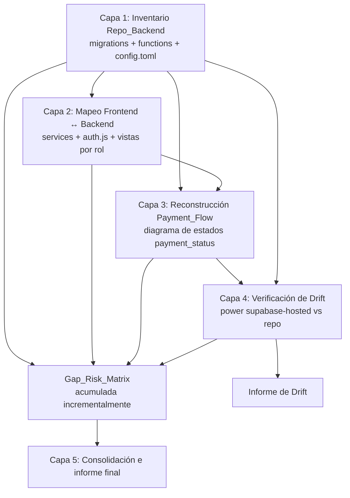
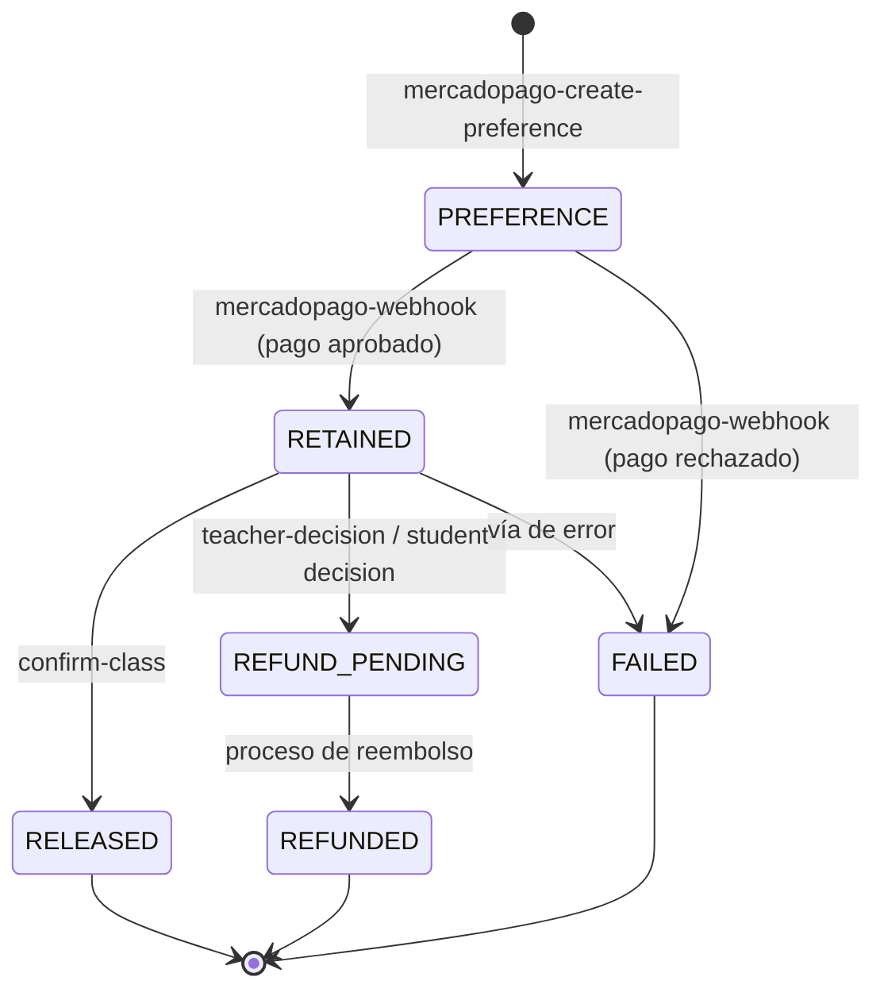

# Design Document

## Overview

Este documento describe **cómo** se ejecutará el análisis de integración del sistema "Modo Ensayo" y **qué entregable documental** produce. No es el diseño de una feature de software: el "sistema" que se diseña aquí es el `Analysis_System`, es decir, el proceso analítico y su resultado.

El análisis produce **un único documento consolidado** en español: `Documentación/10-Analisis-Integracion.md`. Todos los contenidos del análisis (mapa del backend, mapeo frontend↔backend, flujo de pagos, matriz de brechas y riesgos, e informe de drift) se redactan como **capítulos internos** de ese documento, no como archivos separados. Cuando este diseño nombra artefactos conceptuales (`Backend_Map`, `Frontend_Backend_Map`, diagrama del `Payment_Flow`, `Gap_Risk_Matrix`, informe de `Drift`) se refiere a **secciones** dentro del documento único.

El análisis es de solo lectura sobre el código de producción: se parsean migraciones SQL, Edge Functions (Deno/TypeScript) y la capa `frontend/src/services/*` (Vue 3 / JavaScript), y se consulta la base hosteada **únicamente con lecturas** a través del power `supabase-hosted`. No se aplican migraciones, no se despliegan funciones y no se modifica el esquema en vivo.

Dado que el resultado es documentación, los ejemplos de este diseño se expresan en **pseudocódigo estructurado** y en plantillas Markdown/Mermaid, complementados con fragmentos SQL de solo lectura para la verificación de drift.

## Architecture

Arquitectura del análisis — metodología por capas.

### Metodología por capas

El análisis se organiza en cinco capas secuenciales con dependencias explícitas. Cada capa consume las anteriores y, en lugar de crear un archivo propio, **escribe o actualiza su sección correspondiente dentro del documento único** `Documentación/10-Analisis-Integracion.md`, alimentando además la sección de matriz de brechas y riesgos de forma incremental.



La `Gap_Risk_Matrix` (capítulo 4 del documento único) es un contenido transversal: cada capa puede escribir hallazgos en ella en cuanto los detecta, en lugar de esperar a una fase final.

### Capa 1 — Inventario del Repo_Backend

**Fuentes:** `supabase/migrations/*.sql`, `supabase/functions/*/`, `supabase/config.toml`.

Procedimiento:

1. **Tablas y relaciones.** Parsear `20260619000200_tables.sql` (y migraciones posteriores que alteren tablas, p. ej. `20260620000000_classes_discipline_nullable.sql`) para extraer las 27 tablas del esquema `public`, sus columnas, claves primarias y claves foráneas. Construir el grafo de FKs para derivar relaciones.
2. **Enums.** Parsear `20260619000100_enums.sql` para extraer cada `CREATE TYPE ... AS ENUM` con su nombre y lista de valores (incluido `payment_status`).
3. **Funciones RPC y helpers.** Parsear `20260619000101_helpers.sql`, `20260620010000_get_my_attributes.sql` y `20260620010100_handle_new_user_extra_fields.sql` para documentar `get_my_attributes` y `handle_new_user` (firma, entradas, salidas, efectos secundarios, `SECURITY DEFINER`/`INVOKER`).
4. **Triggers y pg_cron.** Parsear `20260619000500_cron_functions.sql` y las definiciones de triggers (en `tables.sql`/`helpers.sql`) para listar cada trigger (tabla y evento que lo dispara, función asociada) y cada job de `pg_cron` (expresión de agenda, comando, efecto).
5. **RLS declarada.** Parsear `20260619000250_helpers_rls.sql` y `20260619000300_rls_policies.sql` para registrar, por tabla, si tiene `ENABLE ROW LEVEL SECURITY` y el texto de cada política (`USING`/`WITH CHECK`).
6. **Edge Functions.** Enumerar los 15 directorios de `supabase/functions/` (excluyendo `_shared/`) y, para cada uno, registrar propósito (a partir del `index.ts`) y su `verify_jwt` según `supabase/config.toml`.

Entregable: **Capítulo 1 — Mapa del Backend Supabase** dentro del documento único (ver "Estructura del entregable").

### Capa 2 — Mapeo Frontend ↔ Backend

**Fuentes:** `frontend/src/services/*`, `frontend/src/stores/auth.js`, `frontend/src/router/index.js`, vistas/páginas por rol y helpers de normalización.

Procedimiento:

1. **Servicios → superficies de datos.** Para cada archivo en `frontend/src/services/*.js`, buscar llamadas `supabase.from('<tabla>')` (PostgREST), `supabase.functions.invoke('<fn>')` (Edge Functions) y `supabase.rpc('<fn>')` (RPC). Construir, por servicio, la lista de tablas, funciones y RPC que invoca.
2. **Autenticación.** Analizar `stores/auth.js`: inicialización de sesión, `onAuthStateChange`, refresh de token, y lectura de roles desde el claim `app_metadata.roles`. Documentar cómo se derivan los roles y cómo se propagan a la UI y al router (guards).
3. **Vistas por rol.** A partir del router y las páginas, mapear las vistas de cada rol (alumno, profesor, sede, admin) y las superficies de datos que cada rol consume (qué servicios/tablas/funciones toca cada vista).
4. **Contrato snake_case ↔ camelCase.** Localizar el helper `camelize` y registrar cada punto donde se normalizan respuestas como una **dependencia de contrato** entre Frontend_Layer y backend (cualquier cambio de nombres de columnas rompe la UI silenciosamente).

Entregable: **Capítulo 2 — Mapeo Frontend↔Backend** dentro del documento único.

### Capa 3 — Reconstrucción del Payment_Flow

**Fuentes:** Edge Functions `mercadopago-create-preference`, `mercadopago-webhook`, `confirm-class`, `teacher-decision`, `student-decision`; tabla `payments`; enum `payment_status`.

Procedimiento:

1. **Extraer transiciones.** Para cada función, identificar las escrituras a `payments.status` (INSERT/UPDATE) y el valor de `payment_status` de origen y destino, junto con la condición que la habilita.
2. **Construir la máquina de estados.** Componer todas las transiciones en un único diagrama de estados de `payment_status`, anotando para cada arista el componente que la ejecuta.
3. **Análisis de idempotencia del webhook.** Revisar `mercadopago-webhook` para determinar si una notificación duplicada (mismo `payment_id`/`data.id` de MercadoPago) produce un segundo INSERT o una segunda transición. Verificar la existencia de una clave de deduplicación (índice único, upsert, o chequeo previo). Registrar el resultado en la `Gap_Risk_Matrix`.
4. **Escenarios de negocio.** Documentar el efecto sobre `payment_status` cuando:
   - una clase con pagos retenidos se **cancela**;
   - un **reagendamiento** afecta a una clase con pagos retenidos;
   - se produce un **reembolso** (vía `teacher-decision`/`student-decision` → `REFUND_PENDING` → `REFUNDED`).
5. **Detección de inconsistencias.** Identificar transiciones de `payment_status` no manejadas, condiciones de carrera (p. ej. webhook y `confirm-class` concurrentes) y vías que dejen un pago en estado inconsistente. Cada hallazgo se registra en la `Gap_Risk_Matrix` con evidencia (archivo + línea/fragmento).

Entregable: **Capítulo 3 — Flujo de Pagos MercadoPago** (diagrama Mermaid de estados) dentro del documento único + entradas en el capítulo 4 (matriz de brechas y riesgos).

### Capa 4 — Verificación de Drift (power `supabase-hosted`)

**Fuentes:** `Hosted_Backend` vía power `supabase-hosted` (solo lectura) contrastado con la Capa 1.

El power se usa **exclusivamente con operaciones de lectura**. Antes de cualquier llamada se lee el steering `supabase-hosted-database-workflow.md` y se resuelve el `project_id` con `list_projects`/`get_project`.

Herramientas y uso previsto:

| Aspecto a verificar | Herramienta del power | Consulta / parámetro |
| --- | --- | --- |
| Inventario de tablas y columnas reales | `list_tables` | `schemas: ["public"]`, `verbose: true` |
| Avisos de seguridad (RLS faltante, etc.) | `get_advisors` | `type: "security"` |
| Avisos de performance (índices, etc.) | `get_advisors` | `type: "performance"` |
| Políticas RLS reales por tabla | `execute_sql` | `SELECT * FROM pg_policies WHERE schemaname='public'` |
| Jobs de `pg_cron` activos | `execute_sql` | `SELECT jobid, schedule, command, active FROM cron.job` |
| Enums desplegados | `execute_sql` | consulta a `pg_type`/`pg_enum` (ver abajo) |
| Funciones desplegadas | `execute_sql` | consulta a `pg_proc`/`information_schema.routines` |
| Triggers desplegados | `execute_sql` | consulta a `information_schema.triggers` |
| Edge Functions desplegadas | `list_edge_functions` | comparar con los 15 directorios del repo |
| Extensiones (incl. `pg_cron`) | `list_extensions` | verificar habilitación |

Consultas SQL de solo lectura de referencia:

```sql
-- Enums desplegados y sus valores
SELECT t.typname, array_agg(e.enumlabel ORDER BY e.enumsortorder) AS values
FROM pg_type t
JOIN pg_enum e ON e.enumtypid = t.oid
JOIN pg_namespace n ON n.oid = t.typnamespace
WHERE n.nspname = 'public'
GROUP BY t.typname;

-- Funciones desplegadas en public
SELECT p.proname, pg_get_function_arguments(p.oid) AS args, p.prosecdef AS security_definer
FROM pg_proc p
JOIN pg_namespace n ON n.oid = p.pronamespace
WHERE n.nspname = 'public';

-- RLS habilitada por tabla
SELECT c.relname, c.relrowsecurity, c.relforcerowsecurity
FROM pg_class c
JOIN pg_namespace n ON n.oid = c.relnamespace
WHERE n.nspname = 'public' AND c.relkind = 'r';
```

Procedimiento de contraste:

1. Para cada categoría (tablas, columnas, RLS, enums, funciones, triggers, `pg_cron`, Edge Functions), comparar el conjunto del `Repo_Backend` (Capa 1) con el del `Hosted_Backend`.
2. Clasificar cada diferencia: `SOLO_REPO`, `SOLO_HOSTED`, o `DIFIERE` (existe en ambos pero con definición distinta).
3. Para cada diferencia, registrar en el **capítulo 5 (Informe de Drift)** la representación de ambos lados.
4. Verificar específicamente el **modelo de pagos heredado de Spring Boot**: comprobar si en el hosted persisten `consolidated_payments` / `payment_items` frente a la tabla `payments` actual; cualquier discrepancia con la documentación del proyecto se registra como Drift.

Entregable: **Capítulo 5 — Informe de Drift repo↔producción** dentro del documento único + entradas en el capítulo 4 (las brechas de RLS/seguridad descubiertas por `get_advisors`).

### Capa 5 — Consolidación

Se revisa el capítulo 4 (matriz de brechas y riesgos) completo, se asigna/normaliza el `Severity_Level` de cada entrada, se ordena por severidad y se redacta el **Resumen Ejecutivo** que encabeza el documento único, con foco prioritario en MercadoPago (ver sección dedicada).

## Components and Interfaces

Estructura del entregable.

El análisis produce **un solo documento Markdown consolidado**, en español, siguiendo buenas prácticas de documentación técnica:

```
Documentación/
  10-Analisis-Integracion.md   (documento único; todas las secciones como capítulos internos)
```

No se crean archivos separados en una carpeta `analysis/`. Cada capa de la metodología escribe o actualiza el capítulo que le corresponde dentro de este archivo. La estructura interna del documento es:

```markdown
# Análisis de Integración del Sistema "Modo Ensayo"

## Resumen Ejecutivo            (foco MercadoPago; redactado en la Capa 5)
## 1. Mapa del Backend Supabase
## 2. Mapeo Frontend ↔ Backend
## 3. Flujo de Pagos MercadoPago
## 4. Matriz de Brechas y Riesgos
## 5. Informe de Drift repo ↔ producción
```

### Resumen Ejecutivo

Encabeza el documento. Redactado al final (Capa 5) pero ubicado al inicio para lectura ejecutiva. Sintetiza los hallazgos ordenados por severidad, **con foco prioritario en MercadoPago** (dinero retenido de alumnos): estado de la idempotencia del webhook, riesgos de doble retención/liberación, y brechas críticas de RLS. Enlaza a los capítulos de detalle.

### Capítulo 1 — Mapa del Backend Supabase

Subsecciones:

- **Tablas** — tabla con columnas: `Tabla | Propósito | PK | FKs (→ tabla) | RLS habilitada (sí/no)`.
- **Diagrama de relaciones** — Mermaid `erDiagram` con las FKs principales.
- **Enums** — `Enum | Valores`.
- **Funciones RPC** — `Función | Entradas | Salidas | Efectos | Security`.
- **Triggers** — `Trigger | Tabla | Evento | Función | Efecto`.
- **Jobs pg_cron** — `Job | Agenda | Comando | Efecto`.
- **Edge Functions** — `Función | Propósito | verify_jwt (config.toml)`.

### Capítulo 2 — Mapeo Frontend ↔ Backend

Subsecciones:

- **Servicios → backend** — `Servicio | Tablas (PostgREST) | Edge Functions | RPC`.
- **Autenticación** — descripción del flujo de `stores/auth.js`, sesión, refresh, y derivación de roles desde `app_metadata.roles`.
- **Vistas por rol** — `Rol | Vistas | Superficies de datos consumidas`.
- **Dependencias de contrato** — puntos de uso de `camelize` y columnas snake_case sensibles.

### Capítulo 3 — Flujo de Pagos MercadoPago

Diagrama de estados de `payment_status` en Mermaid (plantilla de referencia; las aristas reales se confirman en la Capa 3):



Acompañado de:

- **Tabla de transiciones** — `Origen | Destino | Componente | Condición | Idempotente (sí/no)`.
- **Escenarios** — subsecciones para cancelación, reagendamiento y reembolso, cada una indicando el efecto sobre `payment_status`.

### Capítulo 4 — Matriz de Brechas y Riesgos

Tabla única consolidada:

| ID | Categoría | Descripción | Evidencia (archivo:línea / consulta) | Severity_Level | Recomendación |
| --- | --- | --- | --- | --- | --- |

- **Categoría** ∈ {RLS, Pagos, Agendamiento, Auth, Edge Function, Drift, Contrato Frontend, Otro}.
- **Severity_Level** ∈ {`CRITICO`, `ALTO`, `MEDIO`, `BAJO`}.
- Cada entrada debe tener evidencia verificable (ruta + fragmento, o la consulta SQL/herramienta del power que la reveló).

Criterios de severidad (guía):

- `CRITICO`: pérdida o exposición de dinero (pago en estado inconsistente, reembolso no procesado), o acceso no autorizado a datos por RLS ausente.
- `ALTO`: vía de fallo probable bajo operación normal (condición de carrera del webhook, timeout de reagendamiento que bloquea pagos).
- `MEDIO`: fragilidad o deuda con mitigación parcial.
- `BAJO`: mejora cosmética o de mantenibilidad.

### Capítulo 5 — Informe de Drift repo ↔ producción

Subsecciones:

- **Alcance verificado** — qué se consultó en el `Hosted_Backend` y con qué herramienta.
- **Diferencias** — `Categoría | Objeto | Estado (SOLO_REPO/SOLO_HOSTED/DIFIERE) | Repo | Hosted`.
- **Modelo de pagos heredado** — hallazgo específico sobre `consolidated_payments`/`payment_items` vs `payments`.
- **Verificación pendiente** — si el power no estuvo disponible o una consulta falló, qué quedó sin verificar (ver "Manejo de indisponibilidad del power").

## Foco prioritario: MercadoPago

El análisis del `Payment_Flow` recibe atención preferente porque involucra dinero retenido de alumnos. Puntos de revisión obligatorios:

1. **Idempotencia del webhook.** ¿`mercadopago-webhook` deduplica notificaciones repetidas de MercadoPago? Se busca: índice único sobre el identificador externo de pago, patrón `upsert` (`on conflict`), o verificación previa de existencia antes de insertar/transicionar. La ausencia de cualquiera de estos mecanismos se clasifica como mínimo `ALTO` (riesgo de doble retención o doble liberación), y `CRITICO` si puede provocar doble movimiento de dinero.
2. **Cancelación.** Efecto sobre `payment_status` de los pagos `RETAINED` cuando se cancela la clase asociada: ¿pasan a `REFUND_PENDING`? ¿quedan huérfanos en `RETAINED`?
3. **Reagendamiento.** Efecto sobre pagos `RETAINED` al reagendar: interacción con los timeouts de reagendamiento (`pg_cron`) y con `propose-reschedule`.
4. **Reembolso.** Camino completo `RETAINED` → `REFUND_PENDING` → `REFUNDED`, y quién dispara el paso final.
5. **Transiciones inconsistentes.** Cualquier estado del enum `payment_status` alcanzable sin transición de salida manejada, o alcanzable por dos componentes concurrentes con resultados contradictorios.

## Riesgos del propio análisis

| Riesgo | Mitigación |
| --- | --- |
| El parseo estático de SQL/JS pierde transiciones construidas dinámicamente | Complementar con búsqueda textual amplia (`status`, `payment_status`, `update`) y revisión manual de las 5 funciones de pago |
| Documentación del proyecto desactualizada induce conclusiones erróneas | Tratar la documentación como hipótesis; la fuente de verdad es el código del repo y, para drift, el `Hosted_Backend` |
| El `Hosted_Backend` consultado no es el de producción real | Confirmar `project_id` con `list_projects`/`get_project` y registrar el proyecto verificado en el informe de Drift |
| Falsos positivos de RLS por uso de `SECURITY DEFINER` en RPC | Cruzar `get_advisors(security)` con la lectura de `pg_policies` y el análisis de las funciones |
| Datos sensibles devueltos por `execute_sql` | Consultar solo catálogos del sistema (`pg_*`, `information_schema`); no leer datos de usuarios; no volcar secretos en los entregables |

### Manejo de indisponibilidad del power

Si el power `supabase-hosted` no está disponible, no está autenticado, o una consulta concreta al `Hosted_Backend` falla:

1. El análisis **no se detiene**: las Capas 1–3 dependen solo del repositorio y se completan igual.
2. En el informe de Drift se registra explícitamente el **alcance verificado** (qué se logró consultar) y la **verificación pendiente** (qué categorías quedaron sin contrastar y por qué).
3. Cada brecha que habría requerido el hosted se marca como "no verificable en esta corrida" en lugar de asumirse ausente.
4. Se deja constancia de los pasos exactos (herramienta + consulta) para reintentar la verificación cuando el power esté disponible.

## Error Handling

Manejo de errores del análisis.

- **Archivo o migración ausente/ilegible:** registrar la fuente faltante como limitación del análisis en la sección correspondiente del documento único, en vez de inferir su contenido.
- **Ambigüedad en una transición de pago:** registrar la transición como "no determinada por análisis estático" en la tabla de transiciones (capítulo 3) y abrir una entrada de severidad `MEDIO`/`ALTO` en la matriz de brechas y riesgos (capítulo 4) para revisión humana.
- **Discrepancia repo vs hosted:** nunca "corregir" automáticamente; solo documentar ambos lados en el informe de Drift (capítulo 5).
- **Conteo esperado no coincide** (p. ej. ≠ 27 tablas o ≠ 15 Edge Functions): documentar el conteo real observado y la diferencia respecto al esperado como hallazgo.

## Data Models

Modelo de datos del análisis (artefactos internos).

Estructuras conceptuales que el análisis manipula para producir los capítulos del documento único (pseudocódigo):

```
BackendObject = {
  kind: "table" | "enum" | "rpc" | "trigger" | "cron_job" | "edge_function" | "rls_policy",
  name: string,
  source: "repo" | "hosted",
  definition: string,        // texto normalizado para comparar
  metadata: map               // FKs, valores de enum, verify_jwt, schedule, etc.
}

GapEntry = {
  id: string,
  category: string,
  description: string,
  evidence: string,           // archivo:línea o consulta
  severity: "CRITICO" | "ALTO" | "MEDIO" | "BAJO",
  recommendation: string
}

PaymentTransition = {
  from: PaymentStatus,
  to: PaymentStatus,
  component: string,          // una de las 5 Edge Functions
  condition: string,
  idempotent: boolean
}

DriftEntry = {
  category: string,
  object: string,
  state: "SOLO_REPO" | "SOLO_HOSTED" | "DIFIERE",
  repo: string | null,
  hosted: string | null
}
```

Estos objetos no se persisten como código; son el modelo mental que da estructura a las tablas de los capítulos del documento único y permite verificar propiedades de completitud y consistencia sobre el resultado del análisis.

## Correctness Properties

*Una propiedad es una característica o comportamiento que debe cumplirse en todas las ejecuciones válidas del sistema —en este caso, sobre el **documento de análisis** y sus capítulos. Las propiedades son el puente entre la especificación legible y una garantía de corrección verificable. Como este spec produce un documento estructurado, las propiedades se enuncian como invariantes de **completitud** y **consistencia** sobre sus capítulos (Mapa del Backend, Mapeo Frontend↔Backend, Flujo de Pagos, Matriz de Brechas y Riesgos, Informe de Drift) representados según el "Modelo de datos del análisis".*

### Property 1: Completitud del Backend_Map

*Para todo* objeto declarado en el `Repo_Backend` (toda tabla del esquema `public`, todo enum, todo trigger, todo job de `pg_cron` y toda Edge Function de `supabase/functions/` salvo `_shared/`), existe una entrada correspondiente en el `Backend_Map`; cada enum incluye sus valores y cada Edge Function incluye su valor de `verify_jwt` resuelto desde `config.toml`.

**Validates: Requirements 1.1, 1.2, 1.4, 1.5**

### Property 2: Completitud del mapeo de servicios

*Para todo* archivo de `frontend/src/services/*.js`, existe en el `Frontend_Backend_Map` una fila que lo asocia con el conjunto (posiblemente vacío) de tablas PostgREST, Edge Functions y RPC que invoca.

**Validates: Requirements 2.1**

### Property 3: Cobertura de estados del Payment_Flow

*Para todo* valor del enum `payment_status` (`RETAINED`, `RELEASED`, `REFUND_PENDING`, `REFUNDED`, `FAILED`), el diagrama del `Payment_Flow` lo representa como un estado alcanzable o terminal.

**Validates: Requirements 3.1**

### Property 4: Componente dueño de cada transición

*Para toda* transición documentada en la tabla del `Payment_Flow`, el componente que la ejecuta pertenece al conjunto `{mercadopago-create-preference, mercadopago-webhook, confirm-class, teacher-decision, student-decision}`.

**Validates: Requirements 3.2**

### Property 5: Buena formación de la Gap_Risk_Matrix

*Para toda* entrada de la `Gap_Risk_Matrix`, los campos categoría, descripción, evidencia y recomendación son no vacíos, y su `Severity_Level` pertenece al conjunto `{CRITICO, ALTO, MEDIO, BAJO}`.

**Validates: Requirements 4.1, 4.4**

### Property 6: Exhaustividad del registro de riesgos

*Para toda* tabla del esquema `public` sin RLS efectivo, *para toda* Edge Function con `verify_jwt = false` que no sea un webhook de pago, y *para todo* hallazgo de transición de `payment_status` no manejada, condición de carrera o estado inconsistente, existe una entrada en la `Gap_Risk_Matrix` con evidencia verificable no vacía.

**Validates: Requirements 3.6, 4.2, 4.5**

### Property 7: Completitud y buena formación del diff de Drift

*Para todo* objeto presente en el `Repo_Backend` o en el `Hosted_Backend` (cuando el power `supabase-hosted` está disponible), el informe de `Drift` lo clasifica como coincidente o como diferencia; y *para toda* diferencia registrada, el estado `DIFIERE` incluye la representación de ambos lados (repo y hosted) no nula, mientras que `SOLO_REPO`/`SOLO_HOSTED` incluye el lado correspondiente.

**Validates: Requirements 5.2, 5.3**

### Criterios no traducidos a propiedades

Los siguientes criterios se validan por **ejemplo / inspección** (comportamiento concreto y no universal) o son de **integración** (dependen del power externo, sin variación significativa con la entrada), por lo que no se expresan como propiedades universales:

- 1.3 (documentar dos funciones RPC nombradas) — ejemplo.
- 2.2 (descripción de `auth.js` y roles), 2.3 (vistas de los 4 roles), 2.4 (puntos de `camelize`) — ejemplo.
- 3.3 (conclusión de idempotencia del webhook), 3.4 (cancelación), 3.5 (reagendamiento) — ejemplo.
- 4.3 (fragilidad del agendamiento) — ejemplo.
- 5.1 (consultar el `Hosted_Backend` con el power) — integración.
- 5.4 (registrar alcance/pendiente si el power falla), 5.5 (drift del modelo de pagos heredado) — ejemplo / edge case.

## Testing Strategy

Dado que el entregable es un documento, la "verificación" del análisis consiste en chequeos de completitud y consistencia sobre los capítulos estructurados del documento único, complementados con revisión humana:

- **Chequeos tipo propiedad (completitud/consistencia):** para las Propiedades 1–7 se compara el conjunto de objetos declarados/observados contra el conjunto registrado en cada capítulo (diferencia de conjuntos), y se valida el dominio de los campos (severidad, componente, estados del enum). Estos chequeos se ejecutan sobre la representación estructurada del "Modelo de datos del análisis".
- **Chequeos por ejemplo:** para los criterios marcados como ejemplo, se confirma la presencia de las secciones/entradas concretas (funciones RPC nombradas, escenarios de pago, sección de auth, modelo de pagos heredado).
- **Integración con el power:** la consulta al `Hosted_Backend` se realiza una sola vez por categoría (no requiere iteración); su resultado se registra en el capítulo 5 (Informe de Drift) junto con el `project_id` verificado.
- **Cada chequeo de propiedad referencia su propiedad de diseño** mediante la etiqueta **Feature: system-integration-analysis, Property N: {texto}**.
