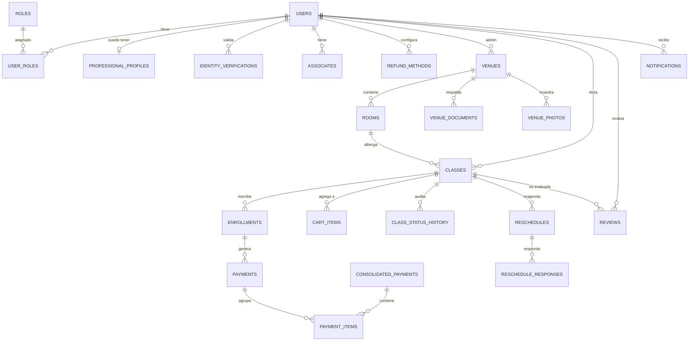

# Modelo de Datos · Modo Ensayo

> **Versión:** 2.0 — Actualizado al 30-may-2026
> **Motor:** PostgreSQL 16
> **Tablas:** 22 entidades principales

## 1. Diagrama Entidad-Relación (conceptual)



## 2. Tablas principales

### 2.1 Usuarios y autenticación

#### `users`
| Columna | Tipo | Constraints |
|---|---|---|
| id | UUID | PK, DEFAULT uuid_generate_v4() |
| email | TEXT | UNIQUE, NOT NULL |
| password_hash | TEXT | NOT NULL |
| full_name | TEXT | NOT NULL |
| social_name | TEXT | |
| rut | TEXT | UNIQUE |
| phone | TEXT | |
| identidad_validada | BOOLEAN | DEFAULT false |
| identidad_estado | TEXT | CHECK IN ('SIN_VALIDAR','PENDING','APROBADO','REJECTED') |
| tiene_sede_aprobada | BOOLEAN | DEFAULT false |
| modo_actual | TEXT | DEFAULT 'alumno' |
| created_at | TIMESTAMPTZ | DEFAULT now() |

#### `roles`
| Columna | Tipo | Constraints |
|---|---|---|
| id | SERIAL | PK |
| name | TEXT | UNIQUE, NOT NULL ('USER','TEACHER','VENUE_ADMIN','ADMIN') |

#### `user_roles`
| Columna | Tipo | Constraints |
|---|---|---|
| user_id | UUID | PK, FK → users(id) ON DELETE CASCADE |
| role_id | INT | PK, FK → roles(id) ON DELETE CASCADE |

#### `identity_verifications`
| Columna | Tipo | Constraints |
|---|---|---|
| id | UUID | PK |
| user_id | UUID | FK → users(id) |
| document_type | TEXT | (RUT, PASAPORTE, etc.) |
| document_number | TEXT | |
| document_url | TEXT | NOT NULL |
| status | TEXT | CHECK IN ('PENDING','APPROVED','REJECTED') |
| reviewed_by | UUID | FK → users(id) |
| rejection_reason | TEXT | |
| created_at | TIMESTAMPTZ | DEFAULT now() |

#### `professional_profiles` (NUEVO)
| Columna | Tipo | Constraints |
|---|---|---|
| id | UUID | PK |
| user_id | UUID | UNIQUE, FK → users(id) |
| description | TEXT | |
| biografia | TEXT | |
| especialidad | TEXT | |
| disciplina_principal | TEXT | |
| disciplinas_secundarias | TEXT | (lista separada por `\|\|`) |
| nivel_ensenanza | TEXT | |
| formacion | TEXT | |
| tipo_formacion | TEXT | (lista separada por `\|\|`) |
| detalle_formacion | TEXT | |
| experience_years | INT | |
| instagram | TEXT | |
| youtube | TEXT | |
| sitio_web | TEXT | |
| linkedin | TEXT | |
| photo_url | TEXT | |
| average_rating | NUMERIC(3,2) | |

#### `associates`
| Columna | Tipo | Constraints |
|---|---|---|
| id | UUID | PK |
| owner_id | UUID | FK → users(id) ON DELETE CASCADE |
| name | TEXT | NOT NULL |
| relation | TEXT | (hijo, hermano, pareja, etc.) |
| birth_date | DATE | |
| rut | TEXT | |

#### `refund_methods`
| Columna | Tipo | Constraints |
|---|---|---|
| id | UUID | PK |
| user_id | UUID | FK → users(id) |
| method | TEXT | (TRANSFERENCIA_BANCARIA, MERCADOPAGO, etc.) |
| details | JSONB | |
| is_preferred | BOOLEAN | DEFAULT false |

### 2.2 Sedes y salas

#### `venues`
| Columna | Tipo | Constraints |
|---|---|---|
| id | UUID | PK |
| admin_id | UUID | FK → users(id) |
| name | TEXT | NOT NULL |
| tipo_sede | TEXT | ('SEDE', 'HOME_STUDIO') |
| address | TEXT | |
| comuna | TEXT | |
| region | TEXT | |
| description | TEXT | |
| phone | TEXT | |
| email | TEXT | |
| status | TEXT | CHECK IN ('PENDIENTE','APROBADA','RECHAZADA') |
| created_at | TIMESTAMPTZ | DEFAULT now() |

#### `rooms`
| Columna | Tipo | Constraints |
|---|---|---|
| id | UUID | PK |
| venue_id | UUID | FK → venues(id) ON DELETE CASCADE |
| name | TEXT | |
| capacity | INT | NOT NULL |
| floor_type | TEXT | |
| has_mirrors | BOOLEAN | DEFAULT false |
| has_sound | BOOLEAN | DEFAULT false |
| has_ballet_bar | BOOLEAN | DEFAULT false |
| has_air_conditioning | BOOLEAN | DEFAULT false |
| has_natural_light | BOOLEAN | DEFAULT false |
| lighting | TEXT | |
| wall_color | TEXT | |
| price_per_hour | INT | |

#### `venue_documents` (NUEVO)
| Columna | Tipo | Constraints |
|---|---|---|
| id | UUID | PK |
| venue_id | UUID | FK → venues(id) |
| nombre | TEXT | |
| tipo_archivo | TEXT | (MIME type) |
| file_url | TEXT | NOT NULL |
| estado | TEXT | DEFAULT 'PENDIENTE' |
| motivo_rechazo | TEXT | |
| created_at | TIMESTAMPTZ | DEFAULT now() |

#### `venue_photos` (NUEVO)
| Columna | Tipo | Constraints |
|---|---|---|
| id | UUID | PK |
| owner_id | UUID | (puede ser venue o room) |
| owner_type | TEXT | ('VENUE', 'ROOM') |
| photo_url | TEXT | NOT NULL |
| alt_text | TEXT | |
| display_order | INT | DEFAULT 0 |
| principal | BOOLEAN | DEFAULT false |

#### `room_availability`
| Columna | Tipo | Constraints |
|---|---|---|
| id | UUID | PK |
| room_id | UUID | FK → rooms(id) ON DELETE CASCADE |
| start_time | TIMESTAMPTZ | |
| end_time | TIMESTAMPTZ | |

### 2.3 Clases

#### `classes`
| Columna | Tipo | Constraints |
|---|---|---|
| id | UUID | PK |
| room_id | UUID | FK → rooms(id) |
| teacher_id | UUID | FK → users(id) |
| venue_id | UUID | FK → venues(id) |
| title | TEXT | |
| discipline | TEXT | |
| level | TEXT | |
| description | TEXT | |
| capacity | INT | |
| duration | INT | (minutos) |
| price | INT | |
| min_age | INT | |
| max_age | INT | |
| start_time | TIMESTAMPTZ | |
| end_time | TIMESTAMPTZ | |
| status | TEXT | CHECK IN ('DRAFT','PUBLISHED','IN_PROGRESS','COMPLETED','POR_VALIDAR','REALIZADA','NO_REALIZADA','CANCELLED','SUSPENDED','FULL') |
| tipo_clase | TEXT | CHECK IN ('PROPIA','ASIGNADA') |
| created_at | TIMESTAMPTZ | DEFAULT now() |

#### `class_status_history`
| Columna | Tipo | Constraints |
|---|---|---|
| id | UUID | PK |
| class_id | UUID | FK → classes(id) ON DELETE CASCADE |
| previous_status | TEXT | |
| new_status | TEXT | |
| changed_by | UUID | FK → users(id) |
| created_at | TIMESTAMPTZ | DEFAULT now() |

#### `enrollments`
| Columna | Tipo | Constraints |
|---|---|---|
| id | UUID | PK |
| class_id | UUID | FK → classes(id) |
| beneficiary_type | TEXT | ('USER', 'ASSOCIATE') |
| beneficiary_id | UUID | |
| owner_id | UUID | FK → users(id) (quien pagó) |
| status | TEXT | DEFAULT 'ACTIVE' |
| created_at | TIMESTAMPTZ | DEFAULT now() |
| | | UNIQUE (class_id, beneficiary_type, beneficiary_id) |

### 2.4 Carrito y pagos

#### `cart_items`
| Columna | Tipo | Constraints |
|---|---|---|
| id | UUID | PK |
| owner_id | UUID | FK → users(id) |
| class_id | UUID | FK → classes(id) |
| beneficiary_type | TEXT | |
| beneficiary_id | UUID | |
| class_title | TEXT | (denormalizado) |
| price | INT | (denormalizado) |
| created_at | TIMESTAMPTZ | DEFAULT now() |

#### `payments`
| Columna | Tipo | Constraints |
|---|---|---|
| id | UUID | PK |
| enrollment_id | UUID | FK → enrollments(id) |
| amount | INT | NOT NULL |
| status | TEXT | CHECK IN ('RETAINED','RELEASED','REFUND_PENDING','REFUNDED','FAILED') |
| created_at | TIMESTAMPTZ | DEFAULT now() |

#### `consolidated_payments`
| Columna | Tipo | Constraints |
|---|---|---|
| id | UUID | PK |
| user_id | UUID | FK → users(id) |
| total_amount | INT | |
| mercadopago_preference_id | TEXT | |
| mercadopago_payment_id | TEXT | |
| status | TEXT | DEFAULT 'PENDING' |
| created_at | TIMESTAMPTZ | DEFAULT now() |

#### `payment_items`
| Columna | Tipo | Constraints |
|---|---|---|
| id | UUID | PK |
| consolidated_payment_id | UUID | FK → consolidated_payments(id) |
| payment_id | UUID | FK → payments(id) |

### 2.5 Reagendamiento

#### `reschedules`
| Columna | Tipo | Constraints |
|---|---|---|
| id | UUID | PK |
| class_id | UUID | FK → classes(id) |
| proposed_time | TIMESTAMPTZ | |
| proposed_room_id | UUID | FK → rooms(id) |
| status | TEXT | ('PROPUESTO','ACEPTADO_MAESTRO','RECHAZADO_MAESTRO','EN_DECISION_ALUMNOS','REAGENDADO','CANCELLED') |
| proposed_by | UUID | FK → users(id) |
| teacher_decision_at | TIMESTAMPTZ | |
| timeout_at | TIMESTAMPTZ | (proposed_time + 48h para alumnos) |
| created_at | TIMESTAMPTZ | DEFAULT now() |

#### `reschedule_responses`
| Columna | Tipo | Constraints |
|---|---|---|
| id | UUID | PK |
| reschedule_id | UUID | FK → reschedules(id) |
| user_id | UUID | FK → users(id) |
| response | TEXT | ('ACEPTADO','RECHAZADO','TIMEOUT') |
| responded_at | TIMESTAMPTZ | |

### 2.6 Reseñas y notificaciones

#### `reviews` (NUEVO)
| Columna | Tipo | Constraints |
|---|---|---|
| id | UUID | PK |
| class_id | UUID | FK → classes(id) |
| target_id | UUID | (usuario evaluado) |
| target_type | TEXT | ('CLASS','TEACHER','VENUE') |
| reviewer_id | UUID | FK → users(id) |
| score | INT | CHECK BETWEEN 1 AND 5 |
| comment | TEXT | |
| created_at | TIMESTAMPTZ | DEFAULT now() |

#### `notifications`
| Columna | Tipo | Constraints |
|---|---|---|
| id | UUID | PK |
| user_id | UUID | FK → users(id) |
| type | TEXT | (RESCHEDULE_NOTIFY, IDENTITY_APPROVED, CLASS_CONFIRMED, etc.) |
| message | TEXT | |
| data | JSONB | |
| read | BOOLEAN | DEFAULT false |
| created_at | TIMESTAMPTZ | DEFAULT now() |

## 3. Triggers y procedimientos almacenados

### `trg_class_status_change`
Registra automáticamente cada cambio de estado de una clase en `class_status_history` con timestamp y usuario.

### `trg_release_payment`
Cuando una clase pasa a `REALIZADA` (o COMPLETED), libera automáticamente todos los pagos asociados de `RETAINED` a `RELEASED`.

### `trg_check_capacity`
Antes de insertar una inscripción, verifica que la clase no esté llena. Lanza error `'La clase está llena'` si se excede la capacidad.

### `trg_update_average_rating`
Cuando se inserta una review, recalcula el `average_rating` del Maestro/Sede afectado.

### `get_user_roles(uuid)`
Función utilitaria que retorna los roles activos de un usuario.

### `get_class_metrics(uuid)`
Función que retorna métricas de una clase (cupos vendidos, pagos retenidos, ingresos potenciales).

## 4. Índices recomendados

```sql
CREATE INDEX idx_classes_status ON classes(status);
CREATE INDEX idx_classes_discipline_status ON classes(discipline, status);
CREATE INDEX idx_classes_start_time ON classes(start_time) WHERE status = 'PUBLISHED';
CREATE INDEX idx_enrollments_class ON enrollments(class_id);
CREATE INDEX idx_payments_status ON payments(status);
CREATE INDEX idx_room_availability_room_time ON room_availability(room_id, start_time);
```

## 5. Scripts de inicialización

Los scripts SQL fuente están en [`../infra/postgres/init/`](../infra/postgres/init/) y copia en [`../Producto/scripts-bd/`](../Producto/scripts-bd/):

1. `01_schema.sql` — DDL de todas las tablas
2. `02_seed.sql` — Datos iniciales (admin, roles)
3. `03_procedures.sql` — Triggers y stored procedures
4. `04_venues_rooms_seed.sql` — Sedes y salas de prueba
5. `05_reschedules_enhance.sql` — Mejoras a reschedules

PostgreSQL los ejecuta automáticamente al levantar el contenedor por primera vez.
