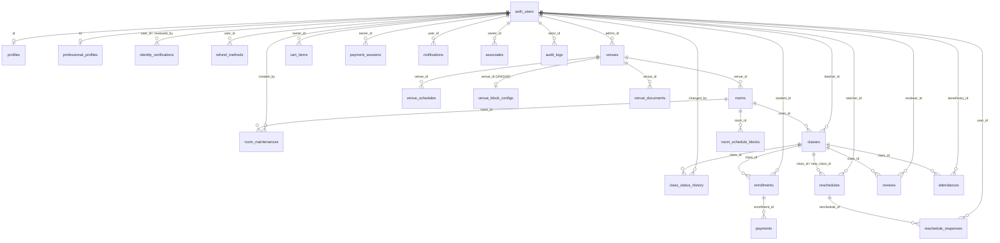

# Análisis de Integración del Sistema "Modo Ensayo"

> Documento consolidado del análisis de integración entre el backend Supabase
> (declarado en el repositorio y desplegado en producción) y el frontend Vue 3,
> con foco prioritario en el flujo de pagos retenidos de MercadoPago.
>
> **Alcance:** solo lectura sobre el código de producción y consultas de solo
> lectura al backend hosteado mediante el power `supabase-hosted`. No se modifica
> código ni esquema en vivo.
>
> Cada capítulo es alimentado por una capa de la metodología de análisis
> (ver `design.md`). La **Matriz de Brechas y Riesgos** (capítulo 4) se completa
> de forma incremental desde varias capas.

---

## Resumen Ejecutivo

El sistema "Modo Ensayo" está, en lo estructural, **bien construido**: las 27
tablas del esquema `public` tienen RLS habilitada, la lógica sensible (pagos,
generación de agenda) se concentra en el servidor, y lo desplegado en producción
es **casi idéntico** a lo versionado en el repositorio. El riesgo no está en la
arquitectura, sino en **vacíos del ciclo de vida del dinero** de los alumnos:
hay caminos por los que un pago retenido **nunca se devuelve** y caminos por los
que **se mueve sin autorización**. Esos son los problemas a resolver primero.

El análisis identificó **24 hallazgos**: **3 críticos, 9 altos, 5 medios y 7
bajos** (detalle completo en el [capítulo 4](#4-matriz-de-brechas-y-riesgos)).
Los tres críticos y la mayoría de los altos giran en torno a **MercadoPago y la
plata retenida**.

### Lo más urgente: el dinero de los alumnos (MercadoPago)

El flujo de pagos retenidos (ver [capítulo 3](#3-flujo-de-pagos-mercadopago))
funciona al **cobrar y retener** (`mercadopago-webhook` deja el pago en
`RETAINED`) y al **liberar** al profesor cuando la clase se realiza
(`confirm-class` → `RELEASED`). El problema está en todo lo que pasa **cuando una
clase no ocurre con normalidad**: el dinero queda atrapado o expuesto.

- **G-06 — El reembolso no existe (CRÍTICO).** Tres caminos reconocen
  formalmente que hay que devolver plata (`REFUND_PENDING`: rechazo del profesor,
  rechazo del alumno y el timeout de 48 h), pero **ningún componente completa la
  devolución**: la transición `REFUND_PENDING → REFUNDED` no está implementada en
  ninguna parte. Todo pago que entra a `REFUND_PENDING` queda **atrapado de forma
  terminal**: el sistema admite la deuda con el alumno pero nunca le devuelve el
  dinero.
- **G-07 — Clase suspendida = pago huérfano (CRÍTICO).** Si `confirm-class` se
  marca con "la clase no se realizó", la clase pasa a `SUSPENDED` pero **los pagos
  no se tocan**: quedan en `RETAINED` indefinidamente, sin liberarse al profesor
  ni encaminarse a reembolso. El alumno pagó por una clase que no ocurrió y su
  plata queda retenida sin salida.
- **G-16 — Movimientos de dinero disparables sin autorización (CRÍTICO).** Varias
  funciones privilegiadas (pensadas solo para el programador `pg_cron`) quedaron
  ejecutables por cualquiera vía RPC, incluso sin sesión. La más grave,
  `process_reschedule_timeouts`, **mueve pagos de otros usuarios** a
  `REFUND_PENDING` y cierra reagendamientos: un tercero podría forzar
  transiciones masivas de estado de dinero a voluntad.

A esto se suman los **altos** que rodean el flujo de pagos y que conviene atacar
en la misma tanda:

- **G-04** — la firma del webhook se valida **solo si** la variable de entorno
  del secreto está presente; si faltara, el webhook aceptaría notificaciones sin
  verificar (debería fallar cerrado).
- **G-05** — la **idempotencia del webhook** no es robusta ante notificaciones
  duplicadas concurrentes (patrón lectura-luego-escritura sin atomicidad). Hoy
  **no hay doble cobro** gracias a un constraint incidental de `enrollments`, no
  por diseño deliberado.
- **G-08** — el estado `FAILED` **nunca se escribe** sobre `payments`: un pago
  rechazado o con contracargo del lado de MercadoPago seguiría figurando como
  `RETAINED` y podría liberarse indebidamente.
- **G-09** — **no existe vía de cancelación** de clase/inscripción pese a existir
  el estado `CANCELLED`; una cancelación real dejaría el pago atrapado en
  `RETAINED`.
- **G-10** — **condición de carrera** entre liberar (`confirm-class`) y reembolsar
  (decisiones/timeout): sin bloqueo de fila, el dinero podría liberarse al
  profesor cuando un rechazo pretendía devolverlo al alumno (o viceversa).

### Otras dimensiones

- **Seguridad de acceso (RLS / Auth).** Ninguna tabla quedó sin RLS, pero el
  análisis del backend hosteado reveló políticas `WITH CHECK (true)` demasiado
  permisivas: **G-19** (cualquier usuario puede inyectar propuestas de
  reagendamiento de clases que no imparte, alimentando transiciones de pago) y
  **G-20** (falsificación de la auditoría de estados de clase). Detalle en los
  [capítulos 1](#1-mapa-del-backend-supabase) y
  [4](#4-matriz-de-brechas-y-riesgos).
- **Agendamiento.** Cadena de fallos encadenados (G-11 a G-15): la regeneración
  semanal de bloques no deduplica y puede **re-disponibilizar salas ya ocupadas**
  (doble reserva), y el reagendamiento **mueve la clase de horario sin
  sincronizar los bloques** ni la confirmación del alumno, lo que enlaza con el
  reembolso atrapado de G-06 (ver
  [capítulo 3](#3-flujo-de-pagos-mercadopago) y
  [capítulo 4](#4-matriz-de-brechas-y-riesgos)).
- **Drift repo ↔ producción.** Lo desplegado coincide casi por completo con el
  repositorio (proyecto hosteado verificado). Diferencias: una función de event
  trigger `rls_auto_enable` (mecanismo de hardening que habilita RLS
  automáticamente, vía el event trigger `ensure_rls`) existe **solo en
  producción** (no versionada); el trigger `trg_venues_updated_at` existe **solo
  en el repo** (en producción `venues.updated_at` no se refresca); y la Edge
  Function privilegiada `admin-users` está desplegada desde un origen no
  versionado (`/tmp`), sin trazabilidad contra el repo (**G-24**). Las 85
  políticas RLS y los triggers de `auth.users` coinciden 1:1 entre repo y
  producción (el delta de conteo previo era un artefacto). El supuesto "modelo de
  pagos heredado de Spring Boot" (`consolidated_payments`/`payment_items`) **no
  existe** en la base real: es un drift solo documental. Detalle en el
  [capítulo 5](#5-informe-de-drift-repo--producción).

### Recomendación de prioridades

1. **Cerrar el ciclo del dinero** (G-06, G-07): implementar el procesamiento real
   del reembolso y dar salida a los pagos de clases suspendidas. Sin esto, hay
   alumnos que pueden quedar sin clase **y** sin su dinero.
2. **Blindar las funciones privilegiadas** (G-16): revocar la ejecución pública
   de las funciones de `pg_cron`/`service_role`.
3. **Endurecer el webhook y las transiciones de pago** (G-04, G-05, G-08, G-09,
   G-10): firma obligatoria, idempotencia atómica, manejo de pagos fallidos,
   cancelación y serialización de transiciones.
4. **Corregir las políticas RLS permisivas y la cadena de agendamiento** (G-19,
   G-20, G-11 a G-15).

---

## 1. Mapa del Backend Supabase

Inventario del `Repo_Backend` derivado de las migraciones SQL del repositorio.
Fuentes principales de esta sección:
`supabase/migrations/20260619000200_tables.sql` (definición de tablas),
`supabase/migrations/20260619000100_enums.sql` (enums) y
`supabase/migrations/20260620000000_classes_discipline_nullable.sql` (alteración
de columnas de `classes`).

### Tablas

Las 27 tablas del esquema `public` en orden de dependencia de claves foráneas
(tal como se declaran en `20260619000200_tables.sql`). La columna **FKs** lista
las claves foráneas con `REFERENCES` explícito; las referencias a `auth.users`
pertenecen al esquema de Supabase Auth (externo a `public`). La columna **RLS
habilitada** indica si la tabla ejecuta `ALTER TABLE ... ENABLE ROW LEVEL
SECURITY` en `20260619000200_tables.sql`; el detalle de las políticas (`USING`/
`WITH CHECK`) se resume en la subsección **Políticas RLS declaradas**.

> **Nota sobre columnas tipo `uuid` sin `REFERENCES`:** varias tablas guardan
> identificadores lógicos sin restricción de FK declarada
> (`profiles.preferred_refund_method_id`, `room_schedule_blocks.class_id`,
> `cart_items.class_id` / `beneficiary_id`, `enrollments.beneficiary_id`,
> `reviews.target_id`, `venue_photos.owner_id`). Son relaciones "blandas" sin
> integridad referencial a nivel de base de datos; se anotan como tales y **no**
> se dibujan como FK en el diagrama de relaciones.

| # | Tabla | Propósito | PK | FKs (→ tabla) | RLS habilitada |
| --- | --- | --- | --- | --- | --- |
| 1 | `profiles` | Perfil base del usuario (extiende `auth.users`); estado de validación de identidad y flags de sede | `id` | `id` → `auth.users`; `preferred_refund_method_id` (uuid, sin FK declarada) | sí |
| 2 | `professional_profiles` | Datos profesionales del profesor (disciplinas, formación, redes, rating) | `id` | `id` → `auth.users` | sí |
| 3 | `identity_verifications` | Solicitudes de verificación de identidad (documento, estado, revisor) | `id` | `user_id` → `auth.users`; `reviewed_by` → `auth.users` | sí |
| 4 | `refund_methods` | Métodos de reembolso bancario del usuario | `id` | `user_id` → `auth.users` | sí |
| 5 | `venues` | Sedes / home studios; estado de aprobación, tipo, contacto | `id` | `admin_id` → `auth.users` | sí |
| 6 | `rooms` | Salas de una sede; capacidad, equipamiento, precio/hora | `id` | `venue_id` → `venues` | sí |
| 7 | `venue_schedules` | Horarios de apertura/cierre por día de la semana de una sede | `id` | `venue_id` → `venues` | sí |
| 8 | `venue_block_configs` | Configuración de generación de bloques (duración, gap) por sede (1:1) | `id` | `venue_id` → `venues` (UNIQUE) | sí |
| 9 | `room_schedule_blocks` | Bloques de agenda de una sala (disponible/ocupado/mantención) | `id` | `room_id` → `rooms`; `class_id` (uuid, sin FK declarada) | sí |
| 10 | `room_maintenances` | Ventanas de mantención de una sala | `id` | `room_id` → `rooms`; `created_by` → `auth.users` | sí |
| 11 | `classes` | Clases publicadas/borrador; disciplina, nivel, precio, sala, profesor | `id` | `room_id` → `rooms`; `teacher_id` → `auth.users` | sí |
| 12 | `class_status_history` | Historial de cambios de estado de una clase | `id` | `class_id` → `classes`; `changed_by` → `auth.users` | sí |
| 13 | `discipline_catalog` | Catálogo de disciplinas y categorías | `id` | _(ninguna)_ | sí |
| 14 | `cart_items` | Ítems del carro de compra de un usuario (snapshot de clase) | `id` | `owner_id` → `auth.users`; `class_id` / `beneficiary_id` (uuid, sin FK declarada) | sí |
| 15 | `payment_sessions` | Sesión de pago MercadoPago (external_reference, preference_id, snapshot del carro) | `id` | `owner_id` → `auth.users` | sí |
| 16 | `enrollments` | Inscripción de un alumno (o beneficiario) en una clase | `id` | `class_id` → `classes`; `student_id` → `auth.users`; `beneficiary_id` (uuid, sin FK declarada) | sí |
| 17 | `payments` | Pago retenido asociado a una inscripción; estado `payment_status` | `id` | `enrollment_id` → `enrollments` | sí |
| 18 | `reschedules` | Propuesta de reagendamiento de una clase | `id` | `class_id` → `classes`; `teacher_id` → `auth.users`; `new_class_id` → `classes` | sí |
| 19 | `reschedule_responses` | Respuesta de un usuario a una propuesta de reagendamiento | `id` | `reschedule_id` → `reschedules`; `user_id` → `auth.users` | sí |
| 20 | `notifications` | Notificaciones in-app por usuario | `id` | `user_id` → `auth.users` | sí |
| 21 | `reviews` | Reseñas polimórficas (clase / sede / alumno) | `id` | `class_id` → `classes` (ON DELETE SET NULL); `reviewer_id` → `auth.users`; `target_id` (uuid, sin FK declarada) | sí |
| 22 | `attendances` | Asistencia de un beneficiario a una clase | `id` | `class_id` → `classes`; `beneficiary_id` → `auth.users` | sí |
| 23 | `associates` | Asociados/beneficiarios de un usuario titular | `id` | `owner_id` → `auth.users` | sí |
| 24 | `venue_photos` | Fotos polimórficas de sede o sala | `id` | `owner_id` (uuid polimórfico, sin FK declarada) | sí |
| 25 | `venue_documents` | Documentos legales/tributarios de una sede | `id` | `venue_id` → `venues` | sí |
| 26 | `audit_logs` | Bitácora de auditoría (actor, acción, recurso, valores) | `id` (bigint identity) | `actor_id` → `auth.users` | sí |
| 27 | `system_metrics` | Métricas del sistema (nombre, valor, labels) | `id` | _(ninguna)_ | sí |

**Conteo observado:** 27 tablas en el esquema `public`, coincidente con las 27
tablas esperadas. No se observan desviaciones de conteo respecto al diseño. Las
tablas se declaran en un único archivo (`20260619000200_tables.sql`) y la única
migración de alteración posterior (`20260620000000_classes_discipline_nullable.sql`)
solo relaja `NOT NULL` en `classes.discipline` y `classes.discipline_category`
(no agrega ni elimina tablas, columnas de FK ni claves).

### Diagrama de relaciones

Diagrama entidad-relación (Mermaid `erDiagram`) con las claves foráneas
**declaradas con `REFERENCES`** dentro del esquema `public`. Se incluye
`auth_users` como entidad externa (esquema `auth` de Supabase) para visualizar
las referencias a usuarios. No se dibujan las columnas `uuid` sin FK declarada
(relaciones blandas, ver nota en la subsección Tablas).

> **Tablas sin FK declarada (nodos aislados en el grafo de FKs):**
> `discipline_catalog`, `system_metrics`, `venue_photos` (su `owner_id` es
> polimórfico sin restricción). Se omiten del diagrama por no tener aristas de
> FK; quedan inventariadas en la tabla anterior.

### Enums

Los 13 enums nativos de PostgreSQL definidos en
`supabase/migrations/20260619000100_enums.sql`.

| Enum | Valores |
| --- | --- |
| `class_status` | `DRAFT`, `PUBLISHED`, `IN_PROGRESS`, `FULL`, `CANCELLED`, `COMPLETED`, `SUSPENDED`, `POR_VALIDAR` |
| `nivel_clase` | `BASICO`, `INTERMEDIO`, `AVANZADO` |
| `tipo_clase` | `PROPIA`, `ASIGNADA` |
| `estado_sede` | `PENDIENTE_APROBACION`, `APROBADA`, `RECHAZADA`, `SUSPENDIDA` |
| `tipo_sede` | `SEDE`, `HOME_STUDIO` |
| `tipo_piso` | `MADERA`, `FLOTANTE`, `CERAMICO`, `VINILO`, `CEMENTO`, `ALFOMBRA`, `OTRO` |
| `tipo_documento_sede` | `RUT_EMPRESA`, `CEDULA_IDENTIDAD`, `INICIO_ACTIVIDADES_F4415`, `CERTIFICADO_SITUACION_TRIBUTARIA`, `CONTRATO_ARRIENDO`, `COMPROBANTE_DOMICILIO`, `PERMISO_MUNICIPAL`, `CARPETA_TRIBUTARIA_ELECTRONICA`, `ESCRITURA_CONSTITUCION`, `AUTORIZACION_NOTARIAL_PROPIETARIO`, `CERTIFICADO_IVA`, `PATENTE_COMERCIAL`, `RESOLUCION_SANITARIA`, `OTRO` |
| `payment_status` | `RETAINED`, `RELEASED`, `REFUND_PENDING`, `REFUNDED`, `FAILED` |
| `payment_session_status` | `PENDING`, `APPROVED`, `FAILED` |
| `reschedule_status` | `PROPOSED`, `TEACHER_ACCEPTED`, `TEACHER_REJECTED`, `COMPLETED` |
| `response_type` | `ACCEPTED`, `REJECTED`, `TIMEOUT`, `RECHAZADO_AUTOMATICO` |
| `review_target_type` | `CLASS`, `VENUE`, `STUDENT` |
| `block_status` | `AVAILABLE`, `OCCUPIED`, `MAINTENANCE` |

**Conteo observado:** 13 enums, coincidente con el comentario de cabecera del
archivo (`13 native PostgreSQL enums`). El enum `payment_status` —central para el
análisis del flujo de pagos (capítulo 3)— está presente con sus 5 valores. Las
columnas `status`/`estado` de algunas tablas (`profiles.identidad_estado`,
`identity_verifications.status`, `enrollments.status`, `venue_documents.estado`,
`associates.status`, `venue_schedules.day_of_week`, `venue_photos.owner_type`)
**no** usan estos enums nativos sino restricciones `CHECK` con texto; se anotan
aquí para no confundirlas con los enums de tipo nativo.

### Funciones RPC

Funciones del esquema `public` declaradas en
`supabase/migrations/20260619000101_helpers.sql`,
`supabase/migrations/20260620010000_get_my_attributes.sql` y
`supabase/migrations/20260620010100_handle_new_user_extra_fields.sql`. Se
distinguen dos grupos: las **funciones RPC de negocio** (invocables desde el
frontend vía `supabase.rpc(...)`) y las **funciones de soporte** (helpers de RLS
y funciones que respaldan triggers, no expuestas como RPC). La columna
**Security** indica `SECURITY DEFINER` (se ejecuta con los privilegios del
propietario de la función, habitual para sortear RLS de forma controlada) o
`SECURITY INVOKER` (privilegios del llamador; es el valor por defecto de
PostgreSQL cuando no se declara).

#### Funciones RPC de negocio

| Función | Entradas | Salidas | Efectos | Security |
| --- | --- | --- | --- | --- |
| `get_my_attributes()` | _(ninguna; usa `auth.uid()` del JWT)_ | `jsonb` con atributos derivados del usuario autenticado: `identidadValidada`, `identidadEstado`, `hasRoleTeacher`, `tieneSedeAprobada`, `estadoSolicitudSede`, `motivoRechazoSede`, `tieneReservasActivas`, `tieneAsignacionesActivas`, `reservasSinClase`, `reservasSinClaseCount`, `estadoProfesor`, `perfilProfesionalCompleto`. Si no hay sesión devuelve `{"error":"no auth"}` | **Solo lectura.** Consulta `profiles`, `venues`, `classes` y `professional_profiles`; aplica la regla de negocio R20 para derivar `estadoProfesor` (`INACTIVO`/`ACTIVO`/`DORMIDO`) y `perfilProfesionalCompleto`. No escribe datos. `STABLE`. `GRANT EXECUTE` a `authenticated` | `SECURITY DEFINER`, `search_path = public, pg_temp` |

> `get_my_attributes` es la única función pensada como **RPC pública** del
> frontend (réplica de `GET /users/me/atributos` del backend Spring original).
> Centraliza en un solo round-trip la lógica de estado del profesor y derivados.
> Al ser `SECURITY DEFINER` + filtro por `auth.uid()`, cada usuario obtiene
> exclusivamente sus propios atributos.

#### Funciones de soporte (helpers y respaldo de triggers)

| Función | Entradas | Salidas | Efectos | Security |
| --- | --- | --- | --- | --- |
| `handle_new_user()` | `trigger` (sobre `auth.users`, fila `NEW`) | `trigger` (`NEW`) | Inserta una fila en `public.profiles` con `id`, `full_name` (o `email` si falta) y, desde la versión `20260620010100`, también `social_name`, `phone` y `rut` tomados de `raw_user_meta_data` (con `NULLIF(...,'')`). Respaldo del trigger `trg_new_user_profile` | `SECURITY DEFINER`, `search_path = public` |
| `assign_default_role()` | `trigger` (sobre `auth.users`, fila `NEW`) | `trigger` (`NEW`) | Asigna el rol `USER` por defecto fusionando `{"roles":["USER"]}` en `auth.users.raw_app_meta_data`. Respaldo del trigger `trg_assign_default_role` | `SECURITY DEFINER`, `search_path = public` |
| `set_updated_at()` | `trigger` (fila `NEW`) | `trigger` (`NEW`) | Fija `NEW.updated_at = now()`. Respaldo de los triggers `BEFORE UPDATE` de 18 tablas | `SECURITY INVOKER` (por defecto; no declarada) |
| `track_class_status()` | `trigger` (sobre `classes`, filas `OLD`/`NEW`) | `trigger` (`NEW`) | Si cambia `status`, inserta en `class_status_history` (`class_id`, `previous_status`, `new_status`, `changed_by = auth.uid()`). Respaldo del trigger `trg_classes_status` | `SECURITY DEFINER`, `search_path = public` |
| `has_role(role_name text)` | `role_name text` | `boolean` | Verifica si el JWT del usuario actual contiene `role_name` en `app_metadata.roles`. Helper de RLS y de `get_my_attributes`. `STABLE` | `SECURITY DEFINER`, `search_path = public, pg_temp` |

> **Nota de alcance:** los helpers de RLS `is_enrolled`, `is_venue_admin` e
> `is_class_teacher` se declaran en `20260619000250_helpers_rls.sql` (después de
> crear las tablas) y se documentan junto con la RLS en la tarea 2.3. Las cinco
> funciones de jobs programados (`process_class_completion`,
> `process_reschedule_timeouts`, `regenerate_schedule_blocks`,
> `check_rls_coverage`, `snapshot_system_metrics`) se listan en la subsección
> **Jobs pg_cron**.

### Triggers

Triggers declarados en `supabase/migrations/20260619000200_tables.sql`. Se
agrupan por la función que ejecutan. Todos son `FOR EACH ROW`.

#### Triggers de auditoría de timestamps (`set_updated_at`)

Dieciocho (18) triggers `BEFORE UPDATE` idénticos, uno por tabla con columna
`updated_at`, que invocan `public.set_updated_at()` para fijar `updated_at =
now()` en cada actualización de fila.

| Trigger | Tabla | Evento | Función | Efecto |
| --- | --- | --- | --- | --- |
| `trg_profiles_updated_at` | `profiles` | `BEFORE UPDATE` | `set_updated_at()` | Refresca `updated_at` |
| `trg_professional_profiles_updated_at` | `professional_profiles` | `BEFORE UPDATE` | `set_updated_at()` | Refresca `updated_at` |
| `trg_idver_updated_at` | `identity_verifications` | `BEFORE UPDATE` | `set_updated_at()` | Refresca `updated_at` |
| `trg_refund_updated_at` | `refund_methods` | `BEFORE UPDATE` | `set_updated_at()` | Refresca `updated_at` |
| `trg_venues_updated_at` | `venues` | `BEFORE UPDATE` | `set_updated_at()` | Refresca `updated_at` |
| `trg_rooms_updated_at` | `rooms` | `BEFORE UPDATE` | `set_updated_at()` | Refresca `updated_at` |
| `trg_venue_sched_updated_at` | `venue_schedules` | `BEFORE UPDATE` | `set_updated_at()` | Refresca `updated_at` |
| `trg_block_cfg_updated_at` | `venue_block_configs` | `BEFORE UPDATE` | `set_updated_at()` | Refresca `updated_at` |
| `trg_rsb_updated_at` | `room_schedule_blocks` | `BEFORE UPDATE` | `set_updated_at()` | Refresca `updated_at` |
| `trg_maint_updated_at` | `room_maintenances` | `BEFORE UPDATE` | `set_updated_at()` | Refresca `updated_at` |
| `trg_classes_updated_at` | `classes` | `BEFORE UPDATE` | `set_updated_at()` | Refresca `updated_at` |
| `trg_cart_updated_at` | `cart_items` | `BEFORE UPDATE` | `set_updated_at()` | Refresca `updated_at` |
| `trg_enrollment_updated_at` | `enrollments` | `BEFORE UPDATE` | `set_updated_at()` | Refresca `updated_at` |
| `trg_payments_updated_at` | `payments` | `BEFORE UPDATE` | `set_updated_at()` | Refresca `updated_at` |
| `trg_att_updated_at` | `attendances` | `BEFORE UPDATE` | `set_updated_at()` | Refresca `updated_at` |
| `trg_assoc_updated_at` | `associates` | `BEFORE UPDATE` | `set_updated_at()` | Refresca `updated_at` |
| `trg_vphoto_updated_at` | `venue_photos` | `BEFORE UPDATE` | `set_updated_at()` | Refresca `updated_at` |
| `trg_vdoc_updated_at` | `venue_documents` | `BEFORE UPDATE` | `set_updated_at()` | Refresca `updated_at` |

#### Triggers de lógica de negocio

| Trigger | Tabla | Evento | Función | Efecto |
| --- | --- | --- | --- | --- |
| `trg_new_user_profile` | `auth.users` | `AFTER INSERT` | `handle_new_user()` | Crea el `profiles` del nuevo usuario (full_name, social_name, phone, rut desde el metadata de signup) |
| `trg_assign_default_role` | `auth.users` | `AFTER INSERT` | `assign_default_role()` | Asigna el rol `USER` por defecto en `app_metadata.roles` |
| `trg_classes_status` | `classes` | `BEFORE UPDATE` | `track_class_status()` | Registra en `class_status_history` cada cambio de `status` de la clase |

**Conteo observado:** 21 triggers en total (18 de `updated_at` + 3 de lógica de
negocio), todos declarados en `20260619000200_tables.sql`. Dos de ellos
(`trg_new_user_profile`, `trg_assign_default_role`) operan sobre `auth.users`
(esquema `auth` de Supabase), no sobre tablas de `public`.

### Jobs pg_cron

Seis (6) jobs programados con `cron.schedule(...)` en
`supabase/migrations/20260619000500_cron_functions.sql`. Cinco invocan funciones
`SECURITY DEFINER` definidas en el mismo archivo; el sexto ejecuta un `DELETE`
inline. La agenda usa expresiones cron estándar de cinco campos
(`min hora día-mes mes día-semana`).

| Job | Agenda (cron) | Comando | Efecto |
| --- | --- | --- | --- |
| `process-class-completion` | `*/30 * * * *` (cada 30 min) | `SELECT public.process_class_completion()` | Pasa a `POR_VALIDAR` las clases `PUBLISHED` cuyo `start_time` ya quedó en el pasado |
| `process-reschedule-timeouts` | `0 * * * *` (cada hora) | `SELECT public.process_reschedule_timeouts()` | Para reagendamientos `TEACHER_ACCEPTED` vencidos (`response_deadline < now()`): marca respuestas faltantes como `TIMEOUT`, transiciona los `payments` `RETAINED` afectados a `REFUND_PENDING` y cierra el reagendamiento como `COMPLETED` |
| `regenerate-schedule-blocks` | `0 4 * * 1` (lunes 04:00) | `SELECT public.regenerate_schedule_blocks()` | Regenera `room_schedule_blocks` (estado `AVAILABLE`) para los próximos 7 días en sedes `APROBADA`, según `venue_schedules` y `venue_block_configs`; usa `ON CONFLICT DO NOTHING` para no duplicar |
| `health-check-rls` | `*/15 * * * *` (cada 15 min) | `SELECT public.check_rls_coverage()` | Cuenta tablas de `public` con `rowsecurity = false`; si hay alguna, registra la métrica `rls_missing_tables` (con labels por tabla) en `system_metrics` |
| `snapshot-metrics` | `0 * * * *` (cada hora) | `SELECT public.snapshot_system_metrics()` | Inserta en `system_metrics` un snapshot: `total_users`, `active_classes`, `completed_classes`, `pending_venues`, `pending_identity`, `retained_total`, `released_total`, `active_enrollments` |
| `cleanup-old-metrics` | `0 3 * * *` (diario 03:00) | `DELETE FROM public.system_metrics WHERE recorded_at < now() - interval '90 days'` | Purga métricas con más de 90 días de antigüedad |

**Conteo observado:** 6 jobs de `pg_cron` y 5 funciones de soporte de jobs. El
job `process-reschedule-timeouts` es relevante para el flujo de pagos
(capítulo 3): es la vía automática que mueve pagos `RETAINED` → `REFUND_PENDING`
cuando expira el plazo de respuesta de un reagendamiento. La extensión `pg_cron`
debe estar habilitada (ver `20260619000000_extensions.sql`); su presencia real
en producción se contrasta en el capítulo 5 (Drift).

### Políticas RLS declaradas

Las 27 tablas del esquema `public` ejecutan `ALTER TABLE ... ENABLE ROW LEVEL
SECURITY` en `20260619000200_tables.sql` (de ahí que la columna **RLS
habilitada** de la subsección Tablas sea **sí** en las 27). Las políticas se
declaran en `20260619000300_rls_policies.sql` y se apoyan en helpers
`SECURITY DEFINER` definidos en `20260619000250_helpers_rls.sql`:
`public.is_enrolled(class_id)`, `public.is_venue_admin(venue_id)` e
`public.is_class_teacher(class_id)` (más `public.has_role(role)` de
`20260619000101_helpers.sql`).

La siguiente tabla resume, por tabla, las operaciones cubiertas por al menos una
política y observaciones relevantes. La sintaxis `USING` se aplica a
`SELECT`/`UPDATE`/`DELETE` (filas visibles/afectables) y `WITH CHECK` a
`INSERT`/`UPDATE` (filas que se pueden escribir).

| # | Tabla | Operaciones con política | Lectura pública (anon) | Observación |
| --- | --- | --- | --- | --- |
| 1 | `profiles` | SELECT, INSERT, UPDATE | no | SELECT/UPDATE propio (`id = auth.uid()`) o ADMIN; sin DELETE |
| 2 | `professional_profiles` | SELECT, INSERT, UPDATE | sí | SELECT abierto (`USING (true)`); escritura solo del dueño |
| 3 | `identity_verifications` | SELECT, INSERT, UPDATE | no | SELECT propio o ADMIN; UPDATE solo ADMIN |
| 4 | `refund_methods` | SELECT, INSERT, DELETE | no | Todo acotado al dueño (`user_id = auth.uid()`); sin UPDATE |
| 5 | `venues` | SELECT, INSERT, UPDATE | sí | SELECT público solo si `status = 'APROBADA'`; admin/ADMIN ven y editan las suyas |
| 6 | `rooms` | SELECT, INSERT, UPDATE | sí | SELECT público solo de sedes `APROBADA`; escritura por admin de sede |
| 7 | `venue_schedules` | SELECT, INSERT, UPDATE, DELETE | sí | SELECT abierto; escritura vía `is_venue_admin(venue_id)` |
| 8 | `venue_block_configs` | SELECT, INSERT, UPDATE | sí | SELECT abierto; escritura vía `is_venue_admin(venue_id)`; sin DELETE |
| 9 | `room_schedule_blocks` | SELECT, UPDATE | sí | SELECT público solo de bloques `AVAILABLE`; **sin política INSERT** (alta solo vía función `SECURITY DEFINER` `regenerate_schedule_blocks` / service role) |
| 10 | `room_maintenances` | SELECT, INSERT, DELETE | no | Acotado a admin de sede o ADMIN; sin UPDATE |
| 11 | `classes` | SELECT, INSERT, UPDATE, DELETE | sí | SELECT público solo si `status = 'PUBLISHED'`; profesor ve/edita las suyas; DELETE solo en `DRAFT` |
| 12 | `class_status_history` | SELECT, INSERT | no | INSERT con `WITH CHECK (true)` (escribe el trigger/sistema); SELECT ADMIN o profesor de la clase |
| 13 | `discipline_catalog` | SELECT, INSERT, UPDATE, DELETE | sí | SELECT abierto; escritura solo ADMIN |
| 14 | `cart_items` | SELECT, INSERT, DELETE | no | Acotado al dueño (`owner_id = auth.uid()`); sin UPDATE |
| 15 | `payment_sessions` | SELECT | no | **Solo SELECT propio**; INSERT/UPDATE únicamente vía service role (Edge Functions de pago) |
| 16 | `enrollments` | SELECT | no | **Solo SELECT** (alumno, profesor de la clase, ADMIN); escritura vía service role |
| 17 | `payments` | SELECT | no | **Solo SELECT** (alumno dueño, profesor de la clase, ADMIN); toda transición de `payment_status` ocurre vía service role (Edge Functions / cron), nunca por el cliente |
| 18 | `reschedules` | SELECT, INSERT | no | INSERT con `WITH CHECK (true)`; SELECT por profesor, inscrito o ADMIN; sin UPDATE/DELETE de cliente |
| 19 | `reschedule_responses` | SELECT, UPDATE | no | SELECT propio o del profesor del reagendamiento; UPDATE propio; sin política INSERT (alta vía service role) |
| 20 | `notifications` | SELECT, UPDATE | no | Acotado al dueño; UPDATE para marcar leído; alta vía service role |
| 21 | `reviews` | SELECT, INSERT, DELETE | sí | SELECT abierto; INSERT del `reviewer_id`; DELETE solo ADMIN |
| 22 | `attendances` | SELECT, INSERT | no | SELECT del profesor o del beneficiario; INSERT del profesor de la clase |
| 23 | `associates` | SELECT, INSERT, DELETE | no | Acotado al dueño (`owner_id = auth.uid()`); sin UPDATE |
| 24 | `venue_photos` | SELECT, INSERT, DELETE | sí | SELECT abierto; escritura por admin de sede (`owner_type = 'VENUE'`) o ADMIN |
| 25 | `venue_documents` | SELECT, INSERT, UPDATE | no | SELECT/INSERT por admin de sede; UPDATE solo ADMIN |
| 26 | `audit_logs` | SELECT | no | **Solo SELECT ADMIN**; alta vía service role |
| 27 | `system_metrics` | SELECT | no | **Solo SELECT ADMIN**; alta vía funciones de cron (`snapshot_system_metrics`) |

**Conteo observado:** 85 políticas `CREATE POLICY` en
`20260619000300_rls_policies.sql`. El comentario de cabecera del archivo declara
"94 policies", por lo que existe una discrepancia de **9 políticas** entre el
comentario y las sentencias reales (85). Se anota como observación de
documentación; la verificación contra las políticas realmente desplegadas en
producción se realiza en el capítulo 5 (Drift).

> **Patrón de escritura vía service role.** Cinco tablas exponen **solo SELECT**
> a los clientes (`payment_sessions`, `enrollments`, `payments`, `audit_logs`,
> `system_metrics`) y otras dos carecen de política `INSERT`
> (`room_schedule_blocks`, `reschedule_responses`). Sus escrituras ocurren
> exclusivamente desde Edge Functions con la `service_role` key (que omite RLS)
> o desde funciones `SECURITY DEFINER` de `pg_cron`. Esto concentra la lógica de
> negocio sensible (transiciones de `payment_status`, generación de bloques) en
> el servidor; el análisis de si cada política cubre correctamente el acceso —y
> el cruce con `get_advisors(security)` del backend hosteado— se desarrolla en
> los capítulos 4 (Matriz de Brechas y Riesgos) y 5 (Drift).

### Edge Functions

Inventario de las **15 Edge Functions** de `supabase/functions/` (se excluye el
directorio `_shared/`, que contiene utilidades compartidas como `logger.ts` y no
es una función desplegable). El propósito se deriva del `index.ts` de cada
función; la columna **`verify_jwt`** se resuelve desde la sección
`[functions.*]` de `supabase/config.toml`. Todas usan el wrapper
`withSupabase({ auth: ... })`: `auth: "user"` exige sesión y `auth: "none"` no
(coherente con `verify_jwt`).

| # | Función | Propósito | `verify_jwt` |
| --- | --- | --- | --- |
| 1 | `mercadopago-create-preference` | Valida disponibilidad y cupos de cada clase del carro, crea el `external_reference` y la preferencia de pago en MercadoPago para iniciar el checkout | `true` |
| 2 | `mercadopago-webhook` | Recibe la notificación de pago de MercadoPago; valida la firma HMAC SHA-256 (MercadoPago no envía JWT) y materializa el pago retenido. **Único endpoint sin JWT por diseño** (webhook externo) | `false` |
| 3 | `create-class` | Crea una clase (publicada o borrador); valida identidad del profesor y conflictos de horario de sala antes de insertar en `classes` | `true` |
| 4 | `assign-reserva` | Asigna un borrador de clase (`DRAFT`) del profesor a una sala/horario concreto, verificando que la sede esté `APROBADA` y sin choques de agenda | `true` |
| 5 | `propose-reschedule` | Crea una propuesta de reagendamiento (`reschedules` en `PROPOSED`) para una clase `PUBLISHED` y notifica al profesor | `true` |
| 6 | `teacher-decision` | El profesor (o admin de sede/ADMIN) acepta o rechaza un reagendamiento `PROPOSED`; al aceptar fija `TEACHER_ACCEPTED`, un `response_deadline` de 48 h y actualiza el horario de la clase | `true` |
| 7 | `student-decision` | El alumno acepta o rechaza un reagendamiento; al rechazar transiciona sus pagos `RETAINED` a `REFUND_PENDING` | `true` |
| 8 | `register-venue` | Registra una sede/home studio del usuario (requiere identidad validada); reutiliza una solicitud `RECHAZADA` previa si existe | `true` |
| 9 | `admin-approve-venue` | ADMIN aprueba o rechaza una sede; al aprobar marca `APROBADA`, otorga el rol `VENUE_ADMIN` al dueño y notifica | `true` |
| 10 | `confirm-class` | Admin de sede/ADMIN confirma si una clase se realizó; si `realized` libera los pagos `RETAINED` → `RELEASED` y marca `COMPLETED` (o `SUSPENDED` si no) | `true` |
| 11 | `generate-blocks` | Admin de sede/ADMIN dispara manualmente la regeneración de bloques de agenda (`rpc('regenerate_schedule_blocks')`) | `true` |
| 12 | `admin-stats` | ADMIN: agrega métricas del sistema (usuarios, clases, ingresos liberados, total retenido, conversión, rating) leyendo varias tablas | `true` |
| 13 | `create-review` | Crea una reseña polimórfica (clase/sede/alumno); exige que el autor haya participado en la clase (inscrito o profesor) | `true` |
| 14 | `book-slot` | Profesor marca un bloque de sala como `OCCUPIED` y lo vincula a una clase; usa `service_role` y un guard atómico (`.eq('status','AVAILABLE')`) contra dobles reservas | `true` |
| 15 | `admin-users` | ADMIN: gestión de usuarios vía Admin API (listar, asignar/revocar roles, habilitar/inhabilitar, eliminar) | `true` |

**Conteo observado:** 15 Edge Functions en `supabase/functions/` (excluyendo
`_shared/`), coincidente con las 15 esperadas y con las 15 secciones
`[functions.*]` declaradas en `supabase/config.toml`. **Solo
`mercadopago-webhook` tiene `verify_jwt = false`**; es un webhook de pago que se
protege con verificación de firma HMAC SHA-256, por lo que **no** constituye una
operación sensible expuesta sin protección (su registro o no en la Matriz de
Brechas y Riesgos se evalúa en la tarea 2.4). Las 14 funciones restantes exigen
JWT (`verify_jwt = true`). La presencia y el `verify_jwt` reales de las
funciones desplegadas se contrastan en el capítulo 5 (Drift).

---

## 2. Mapeo Frontend ↔ Backend

Correspondencia entre la capa de servicios del frontend Vue 3
(`frontend/src/services/*`) y las superficies de acceso a datos del backend
Supabase.

### Servicios → backend

Para cada archivo `frontend/src/services/*.js` se inventaría el conjunto de
**tablas** que consume vía PostgREST (`supabase.from('<tabla>')`), las **Edge
Functions** que invoca y las **RPC** que llama (`supabase.rpc('<fn>')`). Hay una
fila por archivo, incluidos los archivos que no tocan ninguna superficie de datos
(conjunto vacío, marcado con `—`).

Notas de método:

- Las Edge Functions se invocan a través del helper `invokeFunction(name, ...)`
  exportado por `services/supabase.js`, que envuelve `supabase.functions.invoke`
  y adjunta el JWT automáticamente. Por eso la columna **Edge Functions** lista
  el nombre lógico pasado a `invokeFunction(...)`.
- Las **tablas embebidas** (entre paréntesis, marcadas con _emb._) se acceden
  como recursos anidados de PostgREST dentro de un `select` (p. ej.
  `select('*, room:rooms(*, venue:venues(*))')`), no con un `from()` propio; se
  listan porque forman parte del contrato de datos que el servicio consume.
- **Ningún servicio del frontend invoca `supabase.rpc(...)` directamente** (la
  RPC `regenerate_schedule_blocks` se ejecuta server-side dentro de la Edge
  Function `generate-blocks`, no desde el cliente), por lo que la columna **RPC**
  es `—` en todas las filas.

| Servicio | Tablas (PostgREST) | Edge Functions | RPC |
| --- | --- | --- | --- |
| `adminService.js` | `identity_verifications`, `profiles`, `venues` | `admin-stats`, `admin-approve-venue`, `admin-users` | — |
| `associateService.js` | `associates` | — | — |
| `classService.js` | `classes`, `venues`, `rooms`, `attendances`, `payments`, `discipline_catalog` _(emb.: `rooms`, `venues`, `enrollments`, `classes`)_ | `create-class`, `assign-reserva` | — |
| `notificationService.js` | `notifications` | — | — |
| `paymentService.js` | `classes`, `cart_items`, `enrollments`, `payments` _(emb.: `classes`, `rooms`, `venues`, `enrollments`)_ | `mercadopago-create-preference` | — |
| `professionalProfileService.js` | `professional_profiles` | — | — |
| `rescheduleService.js` | `reschedules`, `reschedule_responses`, `notifications` _(emb.: `classes`)_ | `propose-reschedule`, `teacher-decision`, `student-decision` | — |
| `reviewService.js` | `reviews` | `create-review` | — |
| `scheduleService.js` | `venue_schedules`, `venue_block_configs`, `room_schedule_blocks`, `room_maintenances` _(emb.: `rooms`, `venues`)_ | `generate-blocks`, `book-slot` | — |
| `supabase.js` | — | _(genérica: expone `invokeFunction` / `supabase.functions.invoke`; usa además Supabase Auth y Storage)_ | — |
| `uploadService.js` | — _(usa Supabase Storage: buckets `identity-docs`, `avatars`, `venue-photos`, `room-photos`, `venue-documents`)_ | — | — |
| `userService.js` | `profiles`, `refund_methods`, `identity_verifications`, `professional_profiles`, `enrollments` _(emb.: `classes`)_ | — | — |
| `venueService.js` | `venues`, `venue_documents`, `rooms`, `venue_photos` | `register-venue`, `confirm-class` | — |

**Conteo observado:** 13 archivos `.js` en `frontend/src/services/`, cada uno con
su fila. De ellos, 11 son servicios de dominio; `supabase.js` es el cliente
singleton y los helpers compartidos (`invokeFunction`, `camelize`,
`currentUserId`), y `uploadService.js` opera exclusivamente contra Supabase
Storage (sin tablas PostgREST ni Edge Functions). Tres servicios
(`associateService.js`, `notificationService.js`, `professionalProfileService.js`)
solo usan PostgREST. Las Edge Functions referenciadas por el frontend coinciden
con funciones inventariadas en el capítulo 1; en particular, las cinco funciones
del flujo de pagos/reagendamiento (`mercadopago-create-preference`,
`confirm-class`, `propose-reschedule`, `teacher-decision`, `student-decision`) se
invocan desde `paymentService.js`, `venueService.js` y `rescheduleService.js`.

### Autenticación

Fuente: `frontend/src/stores/auth.js` (store respaldado por Supabase Auth) y
`frontend/src/router/index.js` (guards de navegación). El store **mantiene el
contrato de `localStorage` heredado de la versión Spring Boot** para no tocar el
router ni las vistas: `auth_token` (= `access_token` JWT), `auth_user` (objeto
usuario serializado), `auth_refresh_token` y `modoActual`. El estado reactivo
vive en una instancia singleton `AuthStore` (`token`, `user`, `modoActual` como
`ref`s) y se expone a la UI mediante el composable `useAuth()`.

#### Inicialización de sesión y `onAuthStateChange`

- Al cargar el módulo se registra un único listener
  `supabase.auth.onAuthStateChange(async (event, session) => …)`
  (`auth.js:151-166`). Es el punto central de sincronización entre la sesión de
  Supabase y el contrato `localStorage`:
  - `SIGNED_OUT` o `session` nula → `store.clearAuth()` (borra `auth_token`,
    `auth_user`, `auth_refresh_token`).
  - Cualquier otro evento → `store.setToken(session.access_token,
    session.refresh_token)`.
  - `SIGNED_IN` o `INITIAL_SESSION` → además reconstruye el usuario con
    `buildUserFromSession(session)` y lo persiste con `store.setUser(u)`.
- En el arranque en frío, `AuthStore` se hidrata desde `localStorage`
  (`token` desde `auth_token`, `user` desde `parseStoredUser()`), de modo que la
  UI y los guards disponen del usuario **antes** de que llegue
  `INITIAL_SESSION`. `parseStoredUser()` tolera ambos estilos de clave
  (`fullName`/`full_name`, `socialName`/`social_name`) y aplica
  `DEFAULT_ATRIBUTOS` como base de `atributosActivos`.

#### Refresh de token

- El cliente Supabase se crea con `autoRefreshToken: true`, `persistSession:
  true`, `detectSessionInUrl: true` y `flowType: 'pkce'`
  (`services/supabase.js:22-31`). El refresh automático del `access_token` se
  serializa con el lock por defecto (`navigator.locks`) para evitar carreras de
  rotación del `refresh_token` entre llamadas concurrentes (documentado en los
  comentarios del cliente). El cliente es un **singleton cacheado en
  `globalThis`** para evitar múltiples `GoTrueClient` bajo la misma storage key.
- Cuando el cliente refresca el token, el evento resultante de
  `onAuthStateChange` vuelve a invocar `store.setToken(...)`, manteniendo
  `auth_token`/`auth_refresh_token` sincronizados sin intervención de la UI.
- Existe además un refresh explícito `refreshToken()` (`auth.js:281-291`) que
  llama a `supabase.auth.refreshSession()` y actualiza el token; devuelve
  `false` ante error (no lanza), pensado para reintentos desde la capa de red.

#### Derivación de roles desde `app_metadata.roles`

- Los roles se leen del claim `app_metadata.roles` del JWT mediante
  `rolesFromSession(session)` (`auth.js:88-91`): si es un arreglo no vacío se
  usa tal cual, si no se cae a `['USER']`. Este claim lo siembra el backend
  (trigger `assign_default_role` → `{"roles":["USER"]}`) y lo modifican las Edge
  Functions `admin-users` (asignar/revocar) y `admin-approve-venue` (otorga
  `VENUE_ADMIN`).
- `buildUserFromSession()` (`auth.js:97-126`) combina, en paralelo, los roles
  del JWT con el perfil (`profiles`: `full_name`, `social_name`, `phone`) y los
  atributos derivados de la RPC `get_my_attributes()`, normalizados por
  `mapAtributos()` al shape `atributosActivos`.
- **Propagación a la UI:** `useAuth()` expone computeds derivados de
  `user.roles` y `atributosActivos`: `isAdmin` (`ADMIN`), `isSede`
  (`VENUE_ADMIN`), `isTeacher` (`TEACHER`), `puedeAlternarModo`
  (`TEACHER`/`VENUE_ADMIN`/`ADMIN`), `puedeVerContextoProfesor`
  (`atributosActivos.hasRoleTeacher`), `puedeVerContextoSede` (`VENUE_ADMIN`),
  más `identidadValidada`, `estadoProfesor`, etc. `setModo()` persiste el
  contexto activo (`alumno`/`profesor`/`sede`) en `modoActual`.
- **Roles emergentes sin re-login:** `syncAtributos()` (`auth.js:236-258`)
  vuelve a llamar `get_my_attributes()` y, si la RPC reporta `hasRoleTeacher` o
  `tieneSedeAprobada`, añade `TEACHER`/`VENUE_ADMIN` al arreglo de roles en el
  usuario almacenado, de modo que la UI refleja la promoción de rol antes de que
  el JWT se reemita con el claim actualizado.

#### Propagación a los guards del router

`router/index.js` define un único `beforeEach` (`index.js:382-440`) que **no usa
el store ni Pinia**: lee directamente `localStorage.getItem('auth_token')` y
`localStorage.getItem('auth_user')` y parsea este último a JSON. Esto crea un
**acoplamiento de contrato** entre el store (productor del shape `auth_user`) y
el router (consumidor):

| Guard (`meta`) | Comprobación | Redirección si falla |
| --- | --- | --- |
| `requiresAuth` | `isAuthenticated()`: hay `auth_token` y `decodeJwt(token).exp*1000 > Date.now()` | `/login` |
| `guest` | si ya está autenticado | `/` |
| `roles: [...]` | `hasRole()`: alguno de `meta.roles` está en `user.roles` | `/` |
| `requiresIdentity` | `user.atributosActivos.identidadValidada === true` | `/alumno/dashboard` |

- El guard también **expira la sesión localmente**: si hay `auth_token` pero el
  JWT está vencido, borra `auth_token`/`auth_user`/`auth_refresh_token` antes de
  evaluar las reglas.
- **Dependencia de contrato clave:** el router depende de que el objeto
  `auth_user` exponga `roles: string[]` y `atributosActivos.identidadValidada:
  boolean`. Cualquier cambio en esas claves (o que el claim `app_metadata.roles`
  deje de poblarse) rompe los guards de forma silenciosa. La verificación de
  roles es puramente del lado del cliente (defensa de UX); la autorización real
  la imponen las políticas RLS y los `verify_jwt`/checks de las Edge Functions
  (capítulo 1).

### Vistas por rol

Mapeo de las vistas (`frontend/src/views/**`) a los cuatro roles del sistema,
derivado de la metadata de rutas de `router/index.js` y de las superficies de
datos que consume cada grupo (servicios del capítulo 1 / subsección anterior).
El rol **alumno** corresponde al rol base `USER`: sus rutas exigen
`requiresAuth` pero **no** declaran `meta.roles`, por lo que todo usuario
autenticado las alcanza. Los roles `TEACHER`, `VENUE_ADMIN` y `ADMIN` activan
los guards `roles: [...]`.

| Rol | Vistas | Superficies de datos consumidas |
| --- | --- | --- |
| **Alumno** (`USER`, `requiresAuth`) | `alumno/AlumnoDashboardPage`, `alumno/MisClasesPage`, `alumno/MisClasesCalendarioPage`, `alumno/PagosHistorialPage`, `ClaseDetallePage`, `AssociatesPage`, `CartPage`, `payment/CheckoutPage`, `PaymentSuccess/Failure/PendingPage`, `ProfilePage`, `IdentityUploadPage`, `RefundMethodPage`, `NotificacionesPage`, `ReviewsPage` | `classService`, `paymentService`, `associateService`, `userService`, `notificationService`, `reviewService`, `rescheduleService` → tablas `classes`, `enrollments`, `payments`, `cart_items`, `associates`, `profiles`, `refund_methods`, `identity_verifications`, `notifications`, `reviews`; Edge `mercadopago-create-preference`, `create-review`; Storage (`identity-docs`, `avatars`) |
| **Profesor** (`TEACHER`, casi todas `requiresIdentity`) | `profesor/ProfesorDashboardPage`, `ProfesorClasesPropiasPage`, `ProfesorClasesAsignadasPage`, `ProfesorClasesPorAsignarPage`, `ProfesorReagendamientoPage`, `ProfesionalProfilePage`, `ProfesorMetricasPage`, `ProfesorPagosPage`, `ProfesorCalendarioPage`, `AttendancePage`; + sin gate de rol (solo identidad/auth): `BuscarSalasPage`, `ProfesorBorradoresPage`, `ProfesorCrearBorradorPage`, `CrearClasePage` (`profesor/crear-clase`), `TeacherRegistrationPage` | `classService`, `scheduleService`, `rescheduleService`, `professionalProfileService`, `paymentService` → tablas `classes`, `rooms`, `room_schedule_blocks`, `room_maintenances`, `reschedules`, `reschedule_responses`, `professional_profiles`, `attendances`, `payments`; Edge `create-class`, `assign-reserva`, `book-slot`, `generate-blocks`, `propose-reschedule`, `teacher-decision` |
| **Sede** (`VENUE_ADMIN`, `requiresIdentity`) | `sede/SedeDashboardPage`, `SedeAgendaSalaPage` (`sede/salas`), `SedeReagendamientoPage`, `SedeCrearClasePage`, `SedeMisClasesPage`, `SedeClasesPorConfirmarPage`, `SedeProfesoresPage`, `SedeMetricasPage`, `SedeConfiguracionPage`, `SedeCalendarioPage` (`VENUE_ADMIN`+`ADMIN`); + `requiresAuth`: `VenueRegistrationPage`, `RoomRegistrationPage` | `venueService`, `scheduleService`, `classService`, `rescheduleService` → tablas `venues`, `rooms`, `venue_schedules`, `venue_block_configs`, `room_schedule_blocks`, `room_maintenances`, `venue_documents`, `venue_photos`, `classes`, `reschedules`; Edge `register-venue`, `confirm-class`, `generate-blocks`, `book-slot`, `assign-reserva`, `teacher-decision` |
| **Admin** (`ADMIN`) | `admin/AdminDashboardPage`, `AdminUsuariosPage`, `AdminSedesPage`, `DynamicRolesPage` (`admin/roles`) | `adminService` → tablas `profiles`, `venues`, `identity_verifications` (lectura agregada); Edge `admin-stats`, `admin-approve-venue`, `admin-users` |

> **Vistas transversales / públicas (sin rol):** `HomePage`, `LoginPage`,
> `RegisterPage`, `ClassesPage` (catálogo público de clases `PUBLISHED`),
> `QuieroSerProfesorPage`, `QuieroGestionarSedePage` y `NotFoundPage`. Las dos
> páginas de "acceso" (`pages/acceso/*`) son landing de solicitud de rol y no
> exigen autenticación.

> **Observación de autorización (relevante para el capítulo 4).** Varias rutas
> del contexto profesor (`profesor/crear-clase`, `profesor/borradores`,
> `profesor/crear-borrador`, `profesor/buscar-salas`) **no** declaran
> `meta.roles: ['TEACHER']`, solo `requiresIdentity`; un usuario con identidad
> validada pero sin rol `TEACHER` puede navegar a ellas. La protección efectiva
> recae en las Edge Functions (`create-class`, `assign-reserva`) y la RLS, no en
> el guard del router.

### Dependencias de contrato

El frontend fue escrito originalmente para un backend Spring (camelCase) y
consume PostgREST/Edge Functions (snake_case). La traducción de nombres es un
**contrato implícito**: cualquier renombrado de columna en el backend rompe la
UI de forma silenciosa (la propiedad camelCase resultante queda `undefined` sin
error). Existen **tres mecanismos de normalización** snake_case ↔ camelCase, con
distinto grado de fragilidad:

| # | Punto de normalización | Ubicación | Naturaleza | Riesgo de contrato |
| --- | --- | --- | --- | --- |
| 1 | `camelize(value)` — recursivo genérico | `services/supabase.js:51-59` (regex `toCamelKey`, `SNAKE_RE = /_([a-z0-9])/g`) | Convierte **todas** las claves de objetos/arrays de snake_case a camelCase sin enumerar columnas | Bajo por columna (automático), pero **opaco**: un renombrado en backend se propaga como nueva clave camelCase sin aviso |
| 2 | `invokeFunction(name, …)` — normalización central de Edge Functions | `services/supabase.js:100` (`return camelize(data)`) | Toda respuesta de **cualquier** Edge Function pasa por `camelize` antes de llegar a las vistas | Igual que (1); afecta a las 15 Edge Functions de una sola vez |
| 3 | `mapAtributos(d)` — mapeo explícito de `get_my_attributes()` | `auth.js:128-148` | Mapea campo a campo el `jsonb` de la RPC a `atributosActivos`, con coerciones (`=== true`) y defaults | La RPC ya devuelve camelCase; el mapeo fija el shape y depende de claves concretas (`identidadValidada`, `estadoProfesor`, …) |
| 4 | `professionalProfileService.toCamel/toSnake` — mapeo **manual** | `services/professionalProfileService.js:4-49` | **No usa `camelize`**: enumera a mano cada columna en ambos sentidos | **Alto**: contrato más frágil del frontend; cualquier columna de `professional_profiles` que se renombre o agregue debe editarse manualmente en dos funciones |
| 5 | `parseStoredUser()` — tolerancia de doble estilo | `auth.js:71-86` | Acepta `fullName`/`full_name` y `socialName`/`social_name` al rehidratar de `localStorage` | Bajo; mitiga divergencias de shape entre versiones |

**Puntos de uso de `camelize` (mecanismo genérico).** Además de la normalización
central en `invokeFunction`, los siguientes servicios aplican `camelize(...)`
explícitamente sobre respuestas de PostgREST (una llamada por método de lectura):
`adminService`, `associateService`, `classService`, `notificationService`,
`paymentService`, `rescheduleService`, `reviewService`, `scheduleService`,
`userService`, `venueService` (10 servicios). Los servicios
`professionalProfileService` (usa el mapeo manual del punto 4) y `uploadService`
(solo Storage, sin filas tabulares) **no** usan `camelize`.

**Columnas snake_case sensibles** (cuyo renombrado rompería la UI sin error de
compilación): las claves de `payments` (`payment_status`, `enrollment_id`,
`amount`, `created_at`) consumidas por `paymentService`/`classService`; las de
`classes` (`start_time`, `teacher_id`, `room_id`, `discipline_category`,
`status`); las de `reschedules`/`reschedule_responses` (`response_deadline`,
`reschedule_id`, `user_id`); y todo el conjunto enumerado a mano en
`professionalProfileService` (`photo_url`, `average_rating`, `experience_years`,
`nivel_ensenanza`, `sitio_web`, `disciplina_principal`,
`disciplinas_secundarias`, `tipo_formacion`, `detalle_formacion`). Estas
dependencias se cruzan con el capítulo 5 (Drift) para detectar columnas que
difieran entre el repo y el esquema desplegado.

---

## 3. Flujo de Pagos MercadoPago

Reconstrucción de la máquina de estados de `payment_status` a partir del análisis
estático de las cinco Edge Functions de pago
(`mercadopago-create-preference`, `mercadopago-webhook`, `confirm-class`,
`teacher-decision`, `student-decision`) y del job de `pg_cron`
`process_reschedule_timeouts`. El enum `payment_status` tiene cinco valores:
`RETAINED`, `RELEASED`, `REFUND_PENDING`, `REFUNDED`, `FAILED`
(`supabase/migrations/20260619000100_enums.sql:22`).

> **Nota sobre `mercadopago-create-preference`.** Esta función **no escribe nunca**
> `payments.status`: solo crea/actualiza filas en `payment_sessions`
> (`PENDING` → `preference_id`, o `FAILED` si MercadoPago rechaza la preferencia).
> La fila de `payments` se crea recién en el webhook. Por eso aparece en el
> diagrama únicamente como originadora del flujo (creación de la preferencia y la
> sesión de pago), no como dueña de una transición de `payment_status`.

### Diagrama de estados de `payment_status`

```mermaid
stateDiagram-v2
    [*] --> PaymentSession: mercadopago-create-preference<br/>(crea payment_sessions = PENDING; sin fila payments)
    PaymentSession --> RETAINED: mercadopago-webhook<br/>(pago aprobado + enrollment creado → INSERT payments)
    RETAINED --> RELEASED: confirm-class<br/>(VENUE_ADMIN/ADMIN, realized = true)
    RETAINED --> REFUND_PENDING: teacher-decision<br/>(profesor rechaza reagendamiento)
    RETAINED --> REFUND_PENDING: student-decision<br/>(alumno rechaza reagendamiento)
    RETAINED --> REFUND_PENDING: pg_cron process_reschedule_timeouts<br/>(timeout 48h → response TIMEOUT)
    REFUND_PENDING --> REFUNDED: ⚠ sin componente (no implementado)
    RETAINED --> FAILED: ⚠ sin componente (nunca escrito)

    RELEASED --> [*]
    REFUNDED --> [*]
    FAILED --> [*]

    note right of REFUNDED
        Estado terminal del enum, pero ningún
        componente ejecuta REFUND_PENDING → REFUNDED.
        Brecha registrada en el capítulo 4.
    end note
    note right of FAILED
        Valor del enum payment_status que ningún
        componente escribe sobre la tabla payments
        (el FAILED de create-preference es de
        payment_sessions, no de payments).
        Brecha registrada en el capítulo 4.
    end note
```

Los cinco valores de `payment_status` (`RETAINED`, `RELEASED`, `REFUND_PENDING`,
`REFUNDED`, `FAILED`) aparecen representados como estados. `RETAINED`, `RELEASED`
y `REFUND_PENDING` son alcanzables por transiciones implementadas; `REFUNDED` y
`FAILED` figuran como estados del enum **sin transición de entrada implementada**
(ver capítulo 4, Matriz de Brechas y Riesgos).

### Tabla de transiciones

Cada arista anota el **componente dueño** que ejecuta la escritura a
`payments.status`. Las transiciones implementadas pertenecen al conjunto de las
cinco funciones de pago; la transición por vencimiento es propiedad del job de
`pg_cron` `process_reschedule_timeouts` (anotada por separado, no es una de las
cinco Edge Functions).

| Origen | Destino | Componente | Condición | Idempotente |
| --- | --- | --- | --- | --- |
| `payment_sessions` (preferencia, sin fila `payments`) | `RETAINED` | `mercadopago-webhook` | Pago `approved` confirmado contra la API de MercadoPago, sesión aún no `APPROVED`, clase `PUBLISHED` con cupo, y `enrollment` creado; entonces `INSERT payments (status='RETAINED')` (`mercadopago-webhook/index.ts:117-121`) | Sí — guard previo `session.status === "APPROVED"` corta notificaciones duplicadas (`mercadopago-webhook/index.ts:79-82`) |
| `RETAINED` | `RELEASED` | `confirm-class` | `VENUE_ADMIN`/`ADMIN` de la sede confirma la clase como realizada (`realized = true`); `UPDATE payments SET status='RELEASED' WHERE enrollment_id = … AND status='RETAINED'` (`confirm-class/index.ts:41-44`) | Sí — el filtro `.eq("status","RETAINED")` hace no-op sobre filas ya `RELEASED` |
| `RETAINED` | `REFUND_PENDING` | `teacher-decision` | El profesor (o `VENUE_ADMIN`/`ADMIN`) **rechaza** el reagendamiento (`accepted = false`); `UPDATE payments SET status='REFUND_PENDING' WHERE enrollment_id = … AND status='RETAINED'` (`teacher-decision/index.ts:70-72`) | Sí — filtro `.eq("status","RETAINED")` |
| `RETAINED` | `REFUND_PENDING` | `student-decision` | El alumno **rechaza** el reagendamiento (`accepted = false`); `UPDATE payments SET status='REFUND_PENDING' WHERE enrollment_id = … AND status='RETAINED'` (`student-decision/index.ts:36-39`) | Sí — filtro `.eq("status","RETAINED")` |
| `RETAINED` | `REFUND_PENDING` | `pg_cron` `process_reschedule_timeouts` *(no es una de las 5 Edge Functions)* | Vence `response_deadline` (48 h) de un reagendamiento `TEACHER_ACCEPTED`; las respuestas pendientes pasan a `TIMEOUT` y `UPDATE payments SET status='REFUND_PENDING' WHERE … status='RETAINED'` (`20260619000500_cron_functions.sql:29-33`) | Sí — filtro `p.status = 'RETAINED'` y respuesta `TIMEOUT` |
| `REFUND_PENDING` | `REFUNDED` | ⚠ **ninguno** | No existe componente que ejecute esta transición (reembolso no implementado). Hallazgo en capítulo 4 | n/a |
| *(cualquiera)* | `FAILED` | ⚠ **ninguno** | Ningún componente escribe `payments.status='FAILED'`; el `FAILED` de `mercadopago-create-preference/index.ts:79` es sobre `payment_sessions`, no sobre `payments`. Hallazgo en capítulo 4 | n/a |

### Escenarios de negocio

Análisis del efecto sobre `payment_status` en los tres escenarios de negocio que
pueden afectar a una clase con pagos retenidos: **cancelación**,
**reagendamiento** y **reembolso**. El análisis es estático sobre las cinco Edge
Functions de pago, el job `process_reschedule_timeouts` y las migraciones del
esquema. Los hallazgos de inconsistencia derivados de estos escenarios se
registran en el capítulo 4 (Matriz de Brechas y Riesgos, tarea 5.4).

#### Cancelación de una clase

El enum `class_status` incluye el valor `CANCELLED`
(`supabase/migrations/20260619000100_enums.sql:5-7`) y la tabla `enrollments`
admite `status IN ('ACTIVE','CANCELLED')`
(`supabase/migrations/20260619000200_tables.sql:319`), por lo que el **modelo de
datos contempla** la cancelación tanto de una clase como de una inscripción.

Sin embargo, el análisis estático de las 15 Edge Functions, los 6 jobs de
`pg_cron` y las funciones RPC **no encuentra ningún componente que escriba**
`classes.status = 'CANCELLED'` ni `enrollments.status = 'CANCELLED'`. Las únicas
referencias a `CANCELLED` en el código de servidor son **exclusiones** en los
chequeos de conflicto de agenda de `create-class`
(`supabase/functions/create-class/index.ts:43`) y `assign-reserva`
(`supabase/functions/assign-reserva/index.ts:34`) —es decir, leen el valor para
ignorar clases canceladas, nunca lo escriben—. En el frontend, `MisClasesPage`
**lee** `enrollmentStatus === 'CANCELLED'` solo para pintar un badge
(`frontend/src/views/alumno/MisClasesPage.vue:35`), pero ningún servicio de
`frontend/src/services/*` ejecuta esa escritura.

**Efecto sobre `payment_status`:** **ninguno definido.** No existe una vía de
cancelación de clase implementada, por lo que tampoco hay una transición de
`payment_status` asociada a la cancelación. Un pago en `RETAINED` no se ve
afectado porque la operación que lo afectaría no existe.

El camino operativo más cercano a una "cancelación" es `confirm-class` con
`realized = false`: marca la clase como `SUSPENDED`, pero **no toca los pagos**.
La actualización a `RELEASED` está dentro del bloque `if (body.realized)`
(`supabase/functions/confirm-class/index.ts:32-40`), de modo que al suspender la
clase los pagos asociados **quedan en `RETAINED` indefinidamente** (ni liberados
ni marcados para reembolso). Este es un pago en estado inconsistente: la clase no
se realizó, pero el dinero del alumno sigue retenido sin vía de salida. Se
registra como hallazgo en el capítulo 4 (Matriz de Brechas y Riesgos).

#### Reagendamiento de una clase con pagos retenidos

El flujo de reagendamiento es la **única vía implementada** que mueve pagos fuera
de `RETAINED` por una causa distinta a la realización de la clase. Lo originan
`propose-reschedule` (crea `reschedules` en `PROPOSED`) y lo resuelven
`teacher-decision`, `student-decision` y el job `process_reschedule_timeouts`. El
efecto sobre `payment_status` depende de la decisión:

| Sub-escenario | Componente | Efecto sobre `payment_status` | Evidencia |
| --- | --- | --- | --- |
| El profesor **acepta** el reagendamiento | `teacher-decision` (`accepted = true`) | **Sin cambio** (`RETAINED`). Fija `TEACHER_ACCEPTED`, un `response_deadline` de 48 h, mueve el horario de la clase y crea una `reschedule_responses` pendiente por cada alumno para que confirme | `teacher-decision/index.ts:29-62` |
| El profesor **rechaza** el reagendamiento | `teacher-decision` (`accepted = false`) | `RETAINED → REFUND_PENDING` para cada inscripción `ACTIVE` | `teacher-decision/index.ts:63-78` |
| El alumno **acepta** el nuevo horario | `student-decision` (`accepted = true`) | **Sin cambio** (`RETAINED`). El pago permanece retenido a la espera de la confirmación de la clase (`confirm-class`); si todas las respuestas están resueltas, el reagendamiento pasa a `COMPLETED` | `student-decision/index.ts:42-47` |
| El alumno **rechaza** el nuevo horario | `student-decision` (`accepted = false`) | `RETAINED → REFUND_PENDING` para las inscripciones `ACTIVE` del alumno | `student-decision/index.ts:33-39` |
| **Nadie responde** en 48 h tras la aceptación del profesor | `pg_cron` `process_reschedule_timeouts` | Marca las respuestas pendientes como `TIMEOUT` y `RETAINED → REFUND_PENDING` para los pagos cuyo alumno quedó en `TIMEOUT`; cierra el reagendamiento como `COMPLETED` | `20260619000500_cron_functions.sql:18-44` |

**Resumen del efecto:** un reagendamiento solo altera `payment_status` cuando se
**rechaza** (profesor o alumno) o **expira** (timeout), y siempre en la misma
dirección: `RETAINED → REFUND_PENDING`. La aceptación —de cualquiera de las dos
partes— mantiene el pago en `RETAINED`, que luego se libera (`RELEASED`) o se
suspende vía `confirm-class`. Todas estas transiciones están protegidas por el
filtro `.eq("status","RETAINED")` (o `p.status = 'RETAINED'` en el job), por lo
que son idempotentes y no degradan un pago ya liberado o ya marcado para
reembolso.

#### Reembolso: `RETAINED → REFUND_PENDING → REFUNDED`

El camino completo del reembolso tiene **dos tramos con cobertura desigual**:

1. **`RETAINED → REFUND_PENDING` (implementado).** Tres componentes marcan un pago
   para reembolso, todos descritos arriba: `teacher-decision` (rechazo),
   `student-decision` (rechazo) y el job `process_reschedule_timeouts` (timeout
   de 48 h). En los tres casos `REFUND_PENDING` significa "este dinero **debe**
   devolverse al alumno". El sistema dispone además de la infraestructura para el
   destino del reembolso: la tabla `refund_methods` y la columna
   `profiles.preferred_refund_method_id` (capítulo 1) guardan los datos
   bancarios del alumno.

2. **`REFUND_PENDING → REFUNDED` (NO implementado).** **Ningún componente ejecuta
   esta transición.** El análisis estático de las 15 Edge Functions, los 6 jobs
   de `pg_cron` y las funciones RPC no encuentra ninguna escritura de
   `payments.status = 'REFUNDED'`. No hay función de pago que invoque la API de
   reembolsos de MercadoPago ni que registre la devolución manual.

**¿Quién dispara el paso final del reembolso?** **Nadie.** No existe disparador
—ni automático (cron / webhook) ni manual (Edge Function de admin/sede)— que
lleve un pago de `REFUND_PENDING` a `REFUNDED`. En consecuencia, todo pago que
entra a `REFUND_PENDING` **queda atrapado en ese estado de forma terminal**: el
dinero figura como "pendiente de devolver" pero ningún proceso lo devuelve ni
cierra el ciclo. El valor `REFUNDED` del enum `payment_status` es, en la práctica,
**inalcanzable** con el código actual (coherente con el diagrama de estados y la
tabla de transiciones de este capítulo, donde la arista `REFUND_PENDING → REFUNDED`
figura sin componente dueño).

Este es el hallazgo de mayor impacto del Payment_Flow —implica dinero de alumnos
que el sistema reconoce como devolvible pero nunca devuelve— y se registra en el
capítulo 4 (Matriz de Brechas y Riesgos, tarea 5.4) junto con el caso de la clase
suspendida que deja pagos huérfanos en `RETAINED`.

---

## 4. Matriz de Brechas y Riesgos

Tabla única consolidada. Cada capa del análisis (1, 3, 3-complemento y 4) añade
sus hallazgos aquí de forma incremental. Cada entrada debe tener evidencia
verificable (ruta `archivo:línea` o la consulta SQL / herramienta del power que
la reveló).

> **Resultado de la evaluación de RLS y `verify_jwt` (tarea 2.4).** Tras evaluar
> las 27 tablas del esquema `public` y las 15 Edge Functions:
>
> - **Ninguna tabla del esquema `public` carece de RLS efectiva.** Las 27 tablas
>   ejecutan `ALTER TABLE ... ENABLE ROW LEVEL SECURITY` en
>   `supabase/migrations/20260619000200_tables.sql` (líneas 22, 56, 76, 93, 122,
>   157, 173, 186, 203, 219, 252, 264, 275, 294, 310, 328, 343, 361, 373, 387,
>   403, 420, 438, 455, 473, 492, 503). Por tanto **no se registra ninguna
>   brecha por RLS ausente** (AC 4.2); su verificación contra las políticas
>   realmente desplegadas se completa en el capítulo 5 (Drift).
> - **Ninguna Edge Function distinta de un webhook de pago expone una operación
>   sin `verify_jwt`.** La única función con `verify_jwt = false` es
>   `mercadopago-webhook` (`supabase/config.toml:397-398`), que **es** un webhook
>   de pago, por lo que queda fuera del supuesto de AC 4.5. No obstante, se
>   registra una observación sobre la robustez de su protección (G-04).
>
> Las entradas siguientes recogen los hallazgos **relacionados** detectados al
> realizar esta evaluación (nuances de RLS habilitada-sin-política y discrepancia
> de documentación), con su evidencia verificable.

**Resumen por severidad:** 3 CRÍTICO · 9 ALTO · 5 MEDIO · 7 BAJO (24 entradas en total). La tabla está ordenada por severidad descendente (CRITICO → ALTO → MEDIO → BAJO); los identificadores `G-NN` conservan su numeración original de inserción para no romper las referencias cruzadas de otros capítulos.

| ID | Categoría | Descripción | Evidencia (archivo:línea / consulta) | Severity_Level | Recomendación |
| --- | --- | --- | --- | --- | --- |
| G-06 | Pagos | **Reembolso no procesado: la transición `REFUND_PENDING → REFUNDED` no está implementada en ningún componente.** Tres vías marcan pagos como `REFUND_PENDING` (rechazo de profesor, rechazo de alumno, timeout de 48 h), reconociendo formalmente que ese dinero **debe devolverse al alumno**, pero el análisis estático de las 15 Edge Functions, los 6 jobs de `pg_cron` y las funciones RPC **no encuentra ninguna escritura** de `payments.status = 'REFUNDED'` ni llamada a la API de reembolsos de MercadoPago. Todo pago que entra a `REFUND_PENDING` queda atrapado de forma terminal: el sistema reconoce la deuda pero nunca devuelve el dinero. El valor `REFUNDED` del enum es, en la práctica, inalcanzable. Existe infraestructura de destino sin usar (`refund_methods`, `profiles.preferred_refund_method_id`). | Vías que producen `REFUND_PENDING`: `supabase/functions/teacher-decision/index.ts:64-66`, `supabase/functions/student-decision/index.ts:33-37`, `supabase/migrations/20260619000500_cron_functions.sql:29-33`; enum: `supabase/migrations/20260619000100_enums.sql:22` (`REFUNDED` declarado); ausencia: ninguna de las 15 funciones de `supabase/functions/` escribe `status='REFUNDED'` (búsqueda negativa) | CRITICO | Implementar el cierre del reembolso: una Edge Function (admin/sede) o un job de `pg_cron` que tome los `REFUND_PENDING`, invoque la API de reembolsos de MercadoPago (o registre la devolución bancaria vía `refund_methods`) y transicione a `REFUNDED`, con idempotencia y auditoría. Es el hallazgo de mayor impacto del Payment_Flow. |
| G-07 | Pagos | **Clase suspendida deja pagos huérfanos en `RETAINED` sin vía de salida.** Cuando `confirm-class` se invoca con `realized = false`, la clase pasa a `SUSPENDED` pero **los pagos no se tocan**: la única escritura a `payments` (`RETAINED → RELEASED`) está dentro del bloque `if (body.realized)`. Al suspender, no hay rama que mueva los pagos a `REFUND_PENDING` ni a ningún otro estado, de modo que el dinero del alumno queda retenido indefinidamente para una clase que **no se realizó** (ni liberado al profesor ni marcado para reembolso). Pago en estado inconsistente respecto al hecho de negocio. | `supabase/functions/confirm-class/index.ts:31-44`: el `UPDATE payments SET status='RELEASED' ... .eq("status","RETAINED")` está anidado en `if (body.realized) { ... }` (líneas 31-40); a continuación `classes.status = body.realized ? "COMPLETED" : "SUSPENDED"` (líneas 42-44) sin tocar `payments` en la rama `false` | CRITICO | En la rama `realized = false`, transicionar los pagos `RETAINED` de la clase a `REFUND_PENDING` (y notificar al alumno), de modo que entren al circuito de reembolso (que a su vez requiere resolver G-06). Auditar la operación. |
| G-16 | Auth | **Funciones `SECURITY DEFINER` de operación privilegiada ejecutables por `anon` y `authenticated` vía PostgREST RPC (`/rest/v1/rpc/...`), sin `REVOKE` de `PUBLIC`.** En PostgreSQL toda función recibe `EXECUTE` para `PUBLIC` por defecto y Supabase expone las funciones de `public` como endpoints RPC; ninguna de estas funciones revoca ese permiso. Las críticas: **`process_reschedule_timeouts()`** — cualquier usuario (incluso `anon`) puede invocarla repetidamente para forzar transiciones masivas `RETAINED → REFUND_PENDING` sobre pagos de otros, marcar `reschedule_responses` como `TIMEOUT` y cerrar reagendamientos (`COMPLETED`), manipulando estado de **dinero** sin autorización; **`process_class_completion()`** — mueve todas las clases `PUBLISHED → POR_VALIDAR`; **`regenerate_schedule_blocks()`** — inunda `room_schedule_blocks` a demanda (agrava G-11/G-12). Son operaciones batch reservadas a `pg_cron` que quedan disparables por cualquiera. | `get_advisors(security)`: 15× `anon_security_definer_function_executable` + 15× `authenticated_security_definer_function_executable` (cap. 5, §5.2-F); cuerpos en `supabase/migrations/20260619000500_cron_functions.sql:7-13` (`process_class_completion`), `:18-39` (`process_reschedule_timeouts`, escribe `payments.status='REFUND_PENDING'`), `:43-87` (`regenerate_schedule_blocks`); funciones desplegadas con `prosecdef=true` en §5.2-E | CRITICO | `REVOKE EXECUTE ON FUNCTION ... FROM PUBLIC, anon, authenticated` para las funciones de uso exclusivo de `pg_cron`/`service_role` (`process_reschedule_timeouts`, `process_class_completion`, `regenerate_schedule_blocks`, `snapshot_system_metrics`, `check_rls_coverage`, `rls_auto_enable`). Deben ejecutarse solo desde el scheduler o el rol de servicio, nunca vía RPC público. |
| G-04 | Edge Function | `mercadopago-webhook` corre con `verify_jwt = false` (correcto: MercadoPago no envía JWT). Se protege con firma HMAC SHA-256, pero **la verificación es condicional**: el código solo valida la firma `if (secret)` (si `MERCADOPAGO_WEBHOOK_SECRET` está definida). Si la variable de entorno faltara o quedara vacía en el despliegue, el webhook **aceptaría notificaciones sin verificar firma**, abriendo la vía a creación de pagos retenidos no autenticados. | `supabase/config.toml:397-398` (`verify_jwt = false`); `supabase/functions/mercadopago-webhook/index.ts:12-19` (`const secret = ...; if (secret) {...}`) y `:42-46` (rechazo 403 solo dentro del bloque condicional) | ALTO | Hacer obligatoria la presencia del secreto: si `MERCADOPAGO_WEBHOOK_SECRET` no está configurada, rechazar la petición (fail-closed) en vez de omitir la verificación. Validar en despliegue que la variable existe. El análisis de idempotencia y transiciones del webhook se desarrolla en el capítulo 3. |
| G-05 | Pagos | **Idempotencia del webhook no robusta ante notificaciones duplicadas concurrentes.** El único mecanismo de deduplicación explícito de `mercadopago-webhook` es el guard de aplicación `session.status === "APPROVED"`. No existe `upsert`/`on conflict`, ni clave de deduplicación sobre el `data.id`/`payment_id` de MercadoPago, ni restricción `UNIQUE` sobre `payments` (el índice `idx_payment_enrollment` es no único; la tabla permite múltiples filas por `enrollment_id`). El guard es un patrón **lectura-luego-escritura (TOCTOU)**: el `SELECT` de la sesión y el `UPDATE status='APPROVED'` no son atómicos ni usan bloqueo de fila (`FOR UPDATE`) ni `UPDATE ... WHERE status='PENDING'`. Ante dos notificaciones del mismo `external_reference` que llegan antes de que la primera confirme el `UPDATE`, **ambas leen `PENDING` y superan el guard**, ejecutando el bucle de inscripción dos veces. La duplicación de la fila `payments` (RETAINED) se evita **incidentalmente** por la restricción `UNIQUE (class_id, student_id)` de `enrollments`: el segundo `INSERT` de inscripción falla, deja `enrollment` nulo y el `if (enrollment)` omite el `INSERT` del pago. Es decir, **no hay doble movimiento de dinero hoy**, pero la protección no es deliberada (depende de un constraint de otra tabla) y el camino concurrente sí genera efectos secundarios duplicados (p. ej. doble `audit_logs` `payment.approved`). En el caso secuencial normal el guard sí es idempotente (la segunda notificación ve `APPROVED` y retorna temprano). | Guard: `supabase/functions/mercadopago-webhook/index.ts:62-67` (`SELECT payment_sessions` + `if (... || session.status === "APPROVED")`); `INSERT payments`: `:96-100` (sin dedup, dentro del bucle de `cart.items`); `UPDATE status='APPROVED'`: `:104-108` (no atómico respecto al `SELECT`); protección incidental: `supabase/migrations/20260619000200_tables.sql:322` (`enrollments UNIQUE (class_id, student_id)`); ausencia de unicidad en pagos: `:343-344` (`idx_payment_enrollment` no único, sin `UNIQUE` por `enrollment_id` ni por `payment_id` externo); `external_reference` UNIQUE solo dedup de sesión: `:300` | ALTO | Hacer la idempotencia explícita y atómica: (1) reemplazar el guard por un `UPDATE payment_sessions SET status='APPROVED' WHERE id=:id AND status='PENDING'` y procesar solo si afectó 1 fila (claim atómico), o usar `SELECT ... FOR UPDATE`; (2) almacenar y verificar el `mercado_pago_payment_id`/`data.id` como clave de deduplicación; (3) añadir una restricción `UNIQUE` sobre `payments` (p. ej. por `enrollment_id` activo) para no depender del constraint de `enrollments`. Reevaluar a `CRITICO` si se elimina o relaja la unicidad de `enrollments`, ya que entonces el camino concurrente sí provocaría doble retención de dinero. |
| G-08 | Pagos | **El valor `FAILED` de `payment_status` nunca se escribe: transición de salida no manejada y enum inalcanzable.** El webhook solo crea pagos en `RETAINED` ante notificación `approved`; no maneja notificaciones posteriores de MercadoPago de rechazo, contracargo (`chargeback`) o reembolso externo. El único `FAILED` que escribe el código es sobre `payment_sessions` en `mercadopago-create-preference`, **no** sobre `payments`. Consecuencia: un pago `RETAINED` que luego falle o sea contracargado del lado de MercadoPago permanece como `RETAINED` en el sistema y podría liberarse (`RELEASED`) indebidamente, creando exposición de dinero ya no disponible. | enum: `supabase/migrations/20260619000100_enums.sql:22` (`FAILED` declarado en `payment_status`); único `FAILED` escrito es sobre `payment_sessions`: `supabase/functions/mercadopago-create-preference/index.ts:84-85`; el webhook solo hace `INSERT payments (status='RETAINED')` y no procesa estados negativos posteriores | ALTO | Manejar en `mercadopago-webhook` las notificaciones de pago rechazado/contracargado/reembolsado y transicionar el `payments` correspondiente a `FAILED` (o `REFUND_PENDING`), evitando que un pago caído quede como `RETAINED` liberable. |
| G-09 | Pagos | **No existe vía de cancelación de clase/inscripción pese a existir el estado `CANCELLED`, dejando pagos sin transición asociada.** El modelo de datos contempla `class_status = 'CANCELLED'` y `enrollments.status IN ('ACTIVE','CANCELLED')`, pero ningún componente de servidor escribe esos valores: las únicas referencias a `CANCELLED` son exclusiones de lectura en chequeos de conflicto de agenda. Si una clase debe cancelarse, no hay operación que la ejecute ni, por tanto, ninguna transición de `payment_status` asociada; combinado con G-06/G-07, una cancelación real dejaría el pago atrapado en `RETAINED` sin salida. | enum: `supabase/migrations/20260619000100_enums.sql:4-6` (`CANCELLED` en `class_status`); CHECK de inscripción: `supabase/migrations/20260619000200_tables.sql:319`; referencias solo de lectura/exclusión: `supabase/functions/create-class/index.ts:43`, `supabase/functions/assign-reserva/index.ts:34`; ausencia de escritura en las 15 functions / 6 jobs / RPC (búsqueda negativa) | ALTO | Definir e implementar el flujo de cancelación (quién puede cancelar y cuándo) que escriba `classes.status`/`enrollments.status = 'CANCELLED'` y transicione los pagos `RETAINED` a `REFUND_PENDING`, integrándolo con el circuito de reembolso (G-06). |
| G-10 | Pagos | **Condición de carrera con resultado contradictorio entre `confirm-class` y las vías de reembolso sobre el mismo `enrollment`.** `confirm-class` (`RETAINED → RELEASED`) y `teacher-decision`/`student-decision`/`process_reschedule_timeouts` (`RETAINED → REFUND_PENDING`) pueden ejecutarse concurrentemente sobre el mismo pago. Las cuatro vías filtran `.eq("status","RETAINED")` pero **ninguna usa bloqueo de fila (`SELECT ... FOR UPDATE`) ni una máquina de estados que impida transiciones contradictorias**: si dos de ellas leen `RETAINED` casi simultáneamente, ambas pasan el filtro y se produce un *lost update* (gana el `UPDATE` que confirme último). Resultado: el dinero puede liberarse al profesor (`RELEASED`) cuando un rechazo/timeout pretendía reembolsarlo al alumno (`REFUND_PENDING`), o viceversa, dejando el pago en un estado que contradice una de las dos decisiones de negocio. Distinta de G-05 (que cubre la duplicación de notificaciones del webhook). | `supabase/functions/confirm-class/index.ts:36-37` (`UPDATE ... 'RELEASED' ... .eq("status","RETAINED")`); `supabase/functions/teacher-decision/index.ts:64-66`; `supabase/functions/student-decision/index.ts:33-37`; `supabase/migrations/20260619000500_cron_functions.sql:29-33`; en las cuatro, el filtro por estado no es atómico respecto a una transición concurrente (sin `FOR UPDATE` ni guard de transición) | ALTO | Serializar las transiciones de `payment_status`: usar `SELECT ... FOR UPDATE` sobre la fila de `payments` o concentrar la transición en una función `SECURITY DEFINER` con bloqueo, y validar la transición de estado permitida (p. ej. no permitir `RELEASED` si ya hay un reagendamiento rechazado pendiente). Reevaluar a `CRITICO` si se confirma que el camino concurrente desemboca habitualmente en movimiento de dinero en la dirección equivocada. |
| G-12 | Agendamiento | **La regeneración semanal recrea bloques `AVAILABLE` sobre franjas ya `OCCUPIED`, re-disponibilizando el mismo sala/horario y habilitando doble reserva.** Como consecuencia directa de G-11, cuando `regenerate_schedule_blocks` corre (lunes 04:00) inserta un bloque `AVAILABLE` nuevo para un `(room_id,start_time,end_time)` que ya tenía un bloque `OCCUPIED` vinculado a una clase: ambos coexisten. El bloque viejo conserva su `class_id` y `status='OCCUPIED'`, pero el nuevo bloque `AVAILABLE` deja el mismo espacio físico **otra vez reservable**. `book-slot` valida disponibilidad por fila de bloque, no por sala/horario, así que otro profesor puede reservar el bloque duplicado → **doble reserva de la misma sala a la misma hora**. Además, el job no purga bloques pasados ni preserva el estado de los existentes (solo inserta). | Job: `supabase/migrations/20260619000500_cron_functions.sql:73-75` (solo `INSERT`, nunca consulta ni preserva `OCCUPIED`); agenda semanal: `:129-131` (`'0 4 * * 1'`); reserva por fila: `supabase/functions/book-slot/index.ts:36-44` (guard `.eq("status","AVAILABLE")` por `blockId`, sin chequeo de conflicto sala/horario) | ALTO | Hacer la regeneración idempotente y consciente del estado: insertar solo franjas inexistentes (apoyándose en el `UNIQUE` de G-11) y nunca crear un `AVAILABLE` que solape un `OCCUPIED`/mantención del mismo sala/horario. Validar conflicto a nivel `(room_id, rango horario)` además del guard por bloque. |
| G-13 | Agendamiento | **El reagendamiento aceptado mueve `classes.start_time/end_time` pero no libera el bloque `OCCUPIED` antiguo ni reserva un bloque para el nuevo horario, desincronizando la agenda física de la clase.** En `teacher-decision` (rama `accepted`) se actualiza el horario de la clase al `proposed_time`, pero **no se toca `room_schedule_blocks`**: el bloque `OCCUPIED` del horario anterior queda bloqueado indefinidamente (nunca vuelve a `AVAILABLE`) y el nuevo horario **no tiene bloque reservado**, por lo que la sala en el nuevo horario puede figurar `AVAILABLE` y ser reservada por otra clase. El estado de agenda (bloques) contradice el estado de la clase (horario). | `supabase/functions/teacher-decision/index.ts:31-44` (update de `reschedules` a `TEACHER_ACCEPTED` + update de `classes.start_time/end_time`; ninguna escritura a `room_schedule_blocks`); `propose-reschedule` tampoco valida disponibilidad del nuevo horario: `supabase/functions/propose-reschedule/index.ts:21-29` | ALTO | Al aceptar un reagendamiento, ejecutar de forma transaccional: liberar el bloque `OCCUPIED` antiguo (`→ AVAILABLE`) y reservar atómicamente el bloque del nuevo horario (`→ OCCUPIED` con `class_id`), validando previamente que el nuevo horario esté disponible (idealmente ya en `propose-reschedule`). |
| G-14 | Agendamiento | **La clase se mueve al nuevo horario antes de la confirmación del alumno; si el alumno no responde, el timeout de 48 h manda su pago `RETAINED → REFUND_PENDING` (que queda atrapado por G-06) pero no revierte el horario, dejando agenda y pago en estados contradictorios.** `teacher-decision` cambia `classes.start_time/end_time` inmediatamente al aceptar, y recién entonces abre la ventana de 48 h (`response_deadline = now()+48h`) para que los alumnos confirmen. El job `process_reschedule_timeouts` (horario, `'0 * * * *'`) detecta los `TEACHER_ACCEPTED` vencidos, marca `reschedule_responses` como `TIMEOUT`, transiciona los pagos `RETAINED → REFUND_PENDING` de los alumnos que no respondieron y cierra el reagendamiento (`COMPLETED`). Pero **la clase permanece en el horario nuevo**, la inscripción del alumno no se cancela, y su dinero entra a `REFUND_PENDING` — estado terminal sin procesamiento de reembolso (G-06). Resultado: el alumno que nunca aceptó el cambio se queda sin clase en su horario original, con el pago atrapado, mientras la clase ya fue movida para todos. | Clase movida antes de confirmar: `supabase/functions/teacher-decision/index.ts:31-44`; deadline 48 h: `:31-35`; timeout: `supabase/migrations/20260619000500_cron_functions.sql:16` (función), `:22-36` (marca `TIMEOUT`, `RETAINED → REFUND_PENDING`, `reschedules → COMPLETED`), `:127-128` (agenda horaria); reembolso nunca procesado: ver G-06 | ALTO | Replantear el orden: no mover el horario de la clase hasta que la confirmación de los alumnos (o el quórum definido) se complete, o revertir `classes.start_time/end_time` y la inscripción cuando el alumno rechaza/expira. Conectar el `REFUND_PENDING` resultante con un circuito de reembolso real (G-06) y notificar el desenlace. |
| G-19 | RLS | **Política `INSERT WITH CHECK (true)` en `reschedules` permite a cualquier `authenticated` crear propuestas de reagendamiento arbitrarias vía PostgREST.** `resched_insert_auth` no restringe `teacher_id = auth.uid()`, por lo que un usuario autenticado puede `POST /rest/v1/reschedules` para clases que **no imparte**, con `teacher_id`, `class_id`, `proposed_time` y `response_deadline` arbitrarios, saltándose por completo la validación server-side de la Edge Function `propose-reschedule`. Combinado con G-13/G-14 y la ejecución abierta de `process_reschedule_timeouts` (G-16), esto puede inyectar reagendamientos que terminen disparando transiciones de pago `RETAINED → REFUND_PENDING`. | `get_advisors(security)`: `rls_policy_always_true` sobre `reschedules.resched_insert_auth` (§5.2-F); política real en §5.2-B y `supabase/migrations/20260619000300_rls_policies.sql:217-219` (`FOR INSERT TO authenticated WITH CHECK (true)`) | ALTO | Reemplazar `WITH CHECK (true)` por `WITH CHECK (teacher_id = auth.uid() AND public.is_class_teacher(class_id))`, o quitar la política de cliente y reservar el alta al `service_role` desde `propose-reschedule` (patrón ya usado en `payments`/`payment_sessions`). |
| G-11 | Agendamiento | **`regenerate_schedule_blocks` usa `ON CONFLICT DO NOTHING` sobre una tabla sin restricción `UNIQUE`, por lo que la cláusula no deduplica nada y cada corrida semanal acumula bloques duplicados.** `room_schedule_blocks` solo tiene PK sobre `id` (`gen_random_uuid()`) y dos índices **no únicos** (`idx_rsb_room_time_status`, `idx_rsb_class`); no existe restricción única sobre `(room_id, start_time, end_time)`. En PostgreSQL, `INSERT ... ON CONFLICT DO NOTHING` sin destino solo puede dispararse ante una restricción única/exclusión; al no haber ninguna (salvo el PK aleatorio que nunca colisiona), el guard es un **no-op**: cada ejecución del job inserta filas nuevas aunque ya exista un bloque para ese sala/horario. La tabla crece sin límite y se generan bloques `AVAILABLE` repetidos para el mismo intervalo. | `INSERT ... ON CONFLICT DO NOTHING`: `supabase/migrations/20260619000500_cron_functions.sql:73-75`; ausencia de `UNIQUE`: `supabase/migrations/20260619000200_tables.sql:189-200` (PK `id`; índices `idx_rsb_room_time_status` e `idx_rsb_class` no únicos; sin `UNIQUE (room_id,start_time,end_time)`) | MEDIO | Añadir una restricción `UNIQUE (room_id, start_time, end_time)` (o `UNIQUE (room_id, start_time)`) a `room_schedule_blocks` para que `ON CONFLICT DO NOTHING` deduplique de verdad, y/o cambiar el `INSERT` a un `WHERE NOT EXISTS`. Sin esto, el resto de hallazgos de agendamiento (G-12) se agravan. |
| G-15 | Agendamiento | **`propose-reschedule` no valida que el horario propuesto esté disponible ni libre de conflictos, y el camino propuesta→aceptación no consulta `room_schedule_blocks` ni mantenciones.** La función solo verifica que la clase exista y esté `PUBLISHED` e inserta la propuesta con un `proposed_time` arbitrario; no comprueba conflictos de sala, solapamientos con otras clases ni `room_maintenances`. Combinado con G-13, una propuesta puede aceptarse y mover la clase a un horario donde la sala ya está ocupada, sin que ningún componente lo impida. | `supabase/functions/propose-reschedule/index.ts:18-29` (solo valida `classes.status='PUBLISHED'`; inserta `reschedules` con `proposed_time` sin chequear disponibilidad); sin lectura de `room_schedule_blocks`/`room_maintenances` en la función | MEDIO | Validar la disponibilidad del horario propuesto en `propose-reschedule` (sala libre, sin solape con clases ni mantenciones) y reservar tentativamente el bloque, de modo que solo se propongan horarios factibles. |
| G-17 | Auth | **Funciones `SECURITY DEFINER` de métricas/diagnóstico/DDL ejecutables por `anon`/`authenticated` vía RPC.** `snapshot_system_metrics()` y `check_rls_coverage()` insertan filas en `system_metrics`: cualquier usuario puede forzar escrituras e inflar/contaminar las métricas del sistema. `rls_auto_enable()` es `SECURITY DEFINER` y por su nombre ejecuta DDL (`ALTER TABLE ... ENABLE ROW LEVEL SECURITY`); ser invocable por `anon` es indebido. Impacto menor que G-16 (no mueve dinero ni expone datos de usuarios), pero permite escritura/DDL por llamadores no autorizados. | `get_advisors(security)` §5.2-F (mismos lints secdef); `supabase/migrations/20260619000500_cron_functions.sql:91-105` (`check_rls_coverage`, INSERT en `system_metrics`), `:109-122` (`snapshot_system_metrics`); `rls_auto_enable` está desplegada (§5.2-E) pero **no existe en las migraciones del repo** (drift, cap. 5 §8.2) — su cuerpo debe verificarse | MEDIO | `REVOKE EXECUTE` de `PUBLIC`/`anon`/`authenticated` sobre estas funciones; restringirlas a `service_role`/`pg_cron`. Verificar el cuerpo real de `rls_auto_enable` en el hosted. |
| G-20 | RLS | **Política `INSERT WITH CHECK (true)` en `class_status_history` permite falsificar la pista de auditoría de estados de clase.** `csh_insert_system` deja que cualquier `authenticated` inserte registros con `class_id`, `previous_status`, `new_status` y `changed_by` arbitrarios vía PostgREST. Esa tabla está pensada para ser escrita **solo** por el trigger `SECURITY DEFINER` `track_class_status`; la política abierta permite inyectar historial inventado o atribuir cambios a otros usuarios (`changed_by`), corrompiendo la trazabilidad. No mueve dinero, pero degrada la integridad de la auditoría. | `get_advisors(security)`: `rls_policy_always_true` sobre `class_status_history.csh_insert_system` (§5.2-F); política real en §5.2-B y `supabase/migrations/20260619000300_rls_policies.sql:159-161` (`FOR INSERT TO authenticated WITH CHECK (true)`); escritor legítimo: `track_class_status()` en `20260619000101_helpers.sql:22-32` | MEDIO | Restringir el `INSERT` (p. ej. `WITH CHECK (changed_by = auth.uid() AND public.is_class_teacher(class_id))`) o eliminar la política de cliente y dejar la escritura exclusivamente al trigger/`service_role`. |
| G-24 | Drift | **La Edge Function privilegiada `admin-users` está desplegada en producción desde un origen no versionado, sin trazabilidad contra el repo.** `list_edge_functions` reporta para `admin-users` un `entrypoint_path = file:///tmp/user_fn_remznaanexwgzeeupctv_<id>/source/index.ts` con `import_map_path = null`, es decir, desplegada fuera del flujo `supabase functions deploy` desde el repositorio (origen en `/tmp`, típico de dashboard/MCP). Es la **única** de las 15 funciones con procedencia no estándar (`book-slot` —antes sospechosa— sí usa la ruta estándar del repo). `admin-users` gestiona usuarios admin (operación privilegiada), por lo que el artefacto realmente en producción podría no corresponder al código versionado `supabase/functions/admin-users/index.ts`, dificultando auditoría y recreación del entorno. El contrato (slug + `verify_jwt=true`) sí coincide; el riesgo es de gobernanza/reproducibilidad, no de exposición directa. | `list_edge_functions` (cap. 5 §5.5.3): `admin-users` con `entrypoint_path` en `/tmp/...` e `import_map_path=null`; resto de funciones con `entrypoint_path = file:///.../supabase/functions/<slug>/index.ts` | MEDIO | Re-desplegar `admin-users` con `supabase functions deploy admin-users` desde el repo para alinear el artefacto productivo con el código versionado, y verificar (diff) que el `index.ts` del repo es el vigente. Incorporar el despliegue de Edge Functions al flujo CI para evitar despliegues manuales fuera de control de versiones. |
| G-01 | Otro | Discrepancia de documentación interna en las políticas RLS: el comentario de cabecera del archivo declara "94 policies" pero solo existen **85** sentencias `CREATE POLICY` reales. No implica acceso indebido, pero induce a error sobre la cobertura de RLS y dificulta la verificación de completitud. | `supabase/migrations/20260619000300_rls_policies.sql:2` (cabecera "RLS POLICIES (94 policies)") vs. recuento de 85 `CREATE POLICY` en el mismo archivo | BAJO | Corregir el comentario de cabecera a "85 policies" (o añadir las 9 políticas faltantes si el conteo 94 era el objetivo de diseño). Contrastar con `pg_policies` del hosted en el capítulo 5 (Drift). |
| G-02 | RLS | `room_schedule_blocks` tiene RLS habilitada y políticas de `SELECT` y `UPDATE`, pero **carece de política `INSERT`**. El alta de bloques solo puede ocurrir vía `service_role` (omite RLS) o la función `SECURITY DEFINER` `regenerate_schedule_blocks`. Es coherente con el diseño (generación server-side), pero un cliente `authenticated` no puede insertar bloques aunque la tabla "parezca" escribible. Riesgo: si una ruta de cliente intentara insertar, fallará silenciosamente por RLS. | RLS: `supabase/migrations/20260619000300_rls_policies.sql:95-114` (políticas `rsb_select_public`, `rsb_select_admin`, `rsb_update_admin`; sin `INSERT`); RLS habilitada: `supabase/migrations/20260619000200_tables.sql:203` | BAJO | Documentar explícitamente que el alta es exclusiva de `service_role`/cron; si en el futuro algún flujo de cliente necesita insertar, añadir una política `INSERT` acotada en lugar de depender de `service_role`. |
| G-03 | RLS | `reschedule_responses` tiene RLS habilitada y políticas de `SELECT` (propio y profesor) y `UPDATE` (propio), pero **carece de política `INSERT`**. El alta de respuestas ocurre vía `service_role` (Edge Functions `teacher-decision`/`student-decision`). Mismo patrón que G-02: la tabla no es insertable por clientes `authenticated`. | RLS: `supabase/migrations/20260619000300_rls_policies.sql:221-228` (políticas `rrep_select_own`, `rrep_select_teacher`, `rrep_update_own`; sin `INSERT`); RLS habilitada: `supabase/migrations/20260619000200_tables.sql:373` | BAJO | Documentar que las respuestas se crean server-side; si se quisiera permitir alta directa del usuario, añadir política `INSERT` con `WITH CHECK (user_id = auth.uid())`. |
| G-18 | Auth | **Falsos positivos / mitigados dentro de los 30 lints `*_security_definer_function_executable`.** No todas las funciones `SECURITY DEFINER` expuestas constituyen riesgo real: (a) los helpers de RLS `has_role()`, `is_enrolled()`, `is_venue_admin()`, `is_class_teacher()` y `get_my_attributes()` filtran por `auth.uid()`/JWT del **propio** llamador, de modo que solo revelan información del usuario que llama (sin exposición de datos ajenos); (b) `handle_new_user()`, `assign_default_role()` y `track_class_status()` son funciones de **trigger** que referencian `NEW`/`OLD` y abortan con error si se invocan por RPC fuera de contexto de trigger, por lo que no son explotables. Se registran como observación de defensa en profundidad, no como exposición efectiva. | `get_advisors(security)` §5.2-F; cuerpos: `supabase/migrations/20260619000101_helpers.sql:13-18` (`has_role`), `:22-32` (`track_class_status` usa `NEW`/`OLD`), `:36-44` (`handle_new_user` usa `NEW`), `:48-57` (`assign_default_role` usa `NEW`); `20260619000250_helpers_rls.sql:5-44` (`is_enrolled`/`is_venue_admin`/`is_class_teacher` filtran por `auth.uid()`); `20260620010000_get_my_attributes.sql:14-18` (`uid := auth.uid()`) — único con `GRANT EXECUTE ... TO authenticated` explícito (`:88`) | BAJO | Como defensa en profundidad, `REVOKE EXECUTE FROM anon` en los helpers y funciones de trigger (no necesitan ser RPC públicas), aunque hoy no exponen datos ajenos. |
| G-21 | RLS | **Buckets de Storage públicos con listado/enumeración habilitado.** Los buckets `avatars`, `room-photos` y `venue-photos` son públicos y sus políticas de `SELECT` sobre `storage.objects` permiten **listar** (no solo leer URLs conocidas) todo el contenido del bucket. El contenido es público por diseño (avatares, fotos de salas y sedes), pero la enumeración expone las rutas de todos los objetos, que suelen incluir identificadores de usuario/sede, facilitando el *scraping* y la inferencia de qué usuarios/sedes existen. | `get_advisors(security)`: 3× `public_bucket_allows_listing` (`avatars`/`avatars_select`, `room-photos`/`rphoto_select`, `venue-photos`/`vphoto_select`) en §5.2-F | BAJO | Limitar la política a lectura por ruta conocida (sin `LIST`), o servir el contenido sensible mediante URLs firmadas; evitar identificadores adivinables en las rutas de objetos. |
| G-22 | Auth | **Protección contra contraseñas filtradas (HaveIBeenPwned) deshabilitada en Supabase Auth.** Permite que los usuarios registren o conserven contraseñas presentes en filtraciones conocidas, elevando el riesgo de *credential stuffing* sobre las cuentas. Higiene de seguridad, sin explotación directa de datos. | `get_advisors(security)`: `auth_leaked_password_protection` (§5.2-F) | BAJO | Activar "Leaked password protection" en la configuración de Auth (Dashboard → Authentication → Policies) y considerar requisitos mínimos de complejidad. |
| G-23 | Otro | **`public.set_updated_at` sin `search_path` fijo (`function_search_path_mutable`).** A diferencia del resto de funciones `SECURITY DEFINER` (que fijan `SET search_path = public, pg_temp`), esta función de trigger no fija su `search_path`, lo que en teoría permite secuestrar la resolución de objetos si un esquema malicioso precede a `public` en la ruta de búsqueda del rol que dispara el trigger. Riesgo bajo (la función solo asigna `NEW.updated_at = now()`), pero es deuda de *hardening*. | `get_advisors(security)`: `function_search_path_mutable` sobre `public.set_updated_at` (§5.2-F); definición en `supabase/migrations/20260619000101_helpers.sql:4-10` (sin `SET search_path`) | BAJO | Añadir `SET search_path = public, pg_temp` a `set_updated_at` (y a cualquier otra función sin él) para fijar la resolución de nombres. |

### Leyenda de categorías

`Categoría` ∈ { **RLS**, **Pagos**, **Agendamiento**, **Auth**, **Edge Function**, **Drift**, **Contrato Frontend**, **Otro** }

### Criterios de severidad

`Severity_Level` ∈ { **CRITICO**, **ALTO**, **MEDIO**, **BAJO** }

- **CRITICO**: pérdida o exposición de dinero (pago en estado inconsistente,
  reembolso no procesado) o acceso no autorizado a datos por RLS ausente.
- **ALTO**: vía de fallo probable bajo operación normal (condición de carrera
  del webhook, timeout de reagendamiento que bloquea pagos).
- **MEDIO**: fragilidad o deuda técnica con mitigación parcial.
- **BAJO**: mejora cosmética o de mantenibilidad.

---

## 5. Informe de Drift repo ↔ producción

> Las subsecciones **Diferencias** (`SOLO_REPO`/`SOLO_HOSTED`/`DIFIERE`) y
> **Modelo de pagos heredado** las completa la Capa 4 (tarea 8.2) contrastando
> los datos crudos capturados abajo contra el inventario del capítulo 1.

### 5.1 Alcance verificado

Verificación realizada con el power `supabase-hosted` (solo lectura) contra el
proyecto hosteado de producción. El `project_id` fue resuelto con `list_projects`
y confirmado contra `supabase/.temp/project-ref`.

- **Proyecto (`project_id` / `ref`):** `remznaanexwgzeeupctv`
- **Nombre:** `modoensayo`
- **Organización:** `hhuyylmbaipsbghqmsdf`
- **Región:** `us-east-2`
- **Estado:** `ACTIVE_HEALTHY`
- **PostgreSQL:** `17.6.1.127` (engine 17)
- **Power disponible:** Sí, autenticado y operativo. Todas las consultas se
  ejecutaron con éxito; no hubo verificación pendiente en esta corrida.

Steering leído antes de operar: `supabase-hosted-database-workflow.md`.

Herramientas y consultas ejecutadas (solo lectura):

| # | Aspecto | Herramienta / Consulta | Parámetros | Resultado |
| --- | --- | --- | --- | --- |
| 1 | Resolución de proyecto | `list_projects` | — | 1 proyecto (`remznaanexwgzeeupctv`) |
| 2 | Inventario de tablas y columnas | `list_tables` | `schemas:["public"]`, `verbose:true` | 27 tablas (ver 5.2-A) |
| 3 | Avisos de seguridad | `get_advisors` | `type:"security"` | 39 lints WARN (ver 5.2-F) |
| 4 | Avisos de performance | `get_advisors` | `type:"performance"` | 4 FK sin índice (INFO), 22 índices sin uso (INFO), múltiples `auth_rls_initplan` y `multiple_permissive_policies` (WARN) |
| 5 | Políticas RLS reales | `execute_sql` | `SELECT ... FROM pg_policies WHERE schemaname='public'` | 85 políticas (ver 5.2-B; diff a nivel `policyname` en 5.5.1) |
| 6 | Jobs de `pg_cron` | `execute_sql` | `SELECT jobid, schedule, command, active, jobname FROM cron.job` | 6 jobs activos (ver 5.2-C) |
| 7 | Enums desplegados | `execute_sql` | `pg_type`/`pg_enum` en `public` | 13 enums (ver 5.2-D) |
| 8 | Funciones desplegadas | `execute_sql` | `pg_proc`/`pg_language` en `public` | 15 funciones (ver 5.2-E) |
| 9 | Triggers desplegados | `execute_sql` | `information_schema.triggers` (schema `public`) | 18 triggers (ver 5.2-G) |
| 10 | Edge Functions desplegadas | `list_edge_functions` | — | 15 funciones ACTIVE (ver 5.2-H) |
| 11 | Extensiones | `list_extensions` | — | `pg_cron` 1.6.4, `pgcrypto`, `uuid-ossp`, `pg_stat_statements`, `supabase_vault` instaladas (ver 5.2-I) |

> Nota de seguridad: las consultas SQL se limitaron a catálogos del sistema
> (`pg_*`, `information_schema`, `cron.job`). No se leyeron datos de usuarios ni
> se ejecutó ninguna operación de escritura/DDL/DML. Los conteos de filas que
> reporta `list_tables` son metadatos del catálogo, no contenido de filas.

### 5.2 Datos crudos capturados del `Hosted_Backend`

Estos bloques son la captura estructurada para que la tarea 8.2 contraste contra
el inventario del Repo_Backend (capítulo 1).

#### 5.2-A — Tablas del esquema `public` (`list_tables`, verbose)

27 tablas, todas con `rls_enabled = true`:

| Tabla | RLS habilitada | PK | FKs (origen → destino) |
| --- | --- | --- | --- |
| associates | sí | id | owner_id → auth.users.id |
| attendances | sí | id | class_id → classes.id; beneficiary_id → auth.users.id |
| audit_logs | sí | id (identity) | actor_id → auth.users.id |
| cart_items | sí | id | owner_id → auth.users.id |
| class_status_history | sí | id | class_id → classes.id; changed_by → auth.users.id |
| classes | sí | id | room_id → rooms.id; teacher_id → auth.users.id |
| discipline_catalog | sí | id | — |
| enrollments | sí | id | class_id → classes.id; student_id → auth.users.id |
| identity_verifications | sí | id | user_id → auth.users.id; reviewed_by → auth.users.id |
| notifications | sí | id | user_id → auth.users.id |
| payment_sessions | sí | id | owner_id → auth.users.id |
| payments | sí | id | enrollment_id → enrollments.id |
| professional_profiles | sí | id | id → auth.users.id |
| profiles | sí | id | id → auth.users.id |
| refund_methods | sí | id | user_id → auth.users.id |
| reschedule_responses | sí | id | reschedule_id → reschedules.id; user_id → auth.users.id |
| reschedules | sí | id | class_id → classes.id; teacher_id → auth.users.id; new_class_id → classes.id |
| reviews | sí | id | class_id → classes.id; reviewer_id → auth.users.id |
| room_maintenances | sí | id | room_id → rooms.id; created_by → auth.users.id |
| room_schedule_blocks | sí | id | room_id → rooms.id |
| rooms | sí | id | venue_id → venues.id |
| system_metrics | sí | id | — |
| venue_block_configs | sí | id | venue_id → venues.id |
| venue_documents | sí | id | venue_id → venues.id |
| venue_photos | sí | id | — |
| venue_schedules | sí | id | venue_id → venues.id |
| venues | sí | id | admin_id → auth.users.id |

> Conteo observado: **27 tablas** en `public`, coincide con el conteo esperado.
> Todas reportan `rls_enabled = true` a nivel de `pg_class`/`list_tables`
> (verificación de políticas efectivas en 5.2-B y advisors en 5.2-F).

#### 5.2-B — Políticas RLS reales (`pg_policies`, schema `public`)

84 políticas en 27 tablas (cifra agregada de la captura previa; el diff a nivel
`policyname` de 5.5.1 corrige el total a **85**, coincidente con el repo —la
enumeración por tabla de abajo ya lista las 85). Detalle por tabla (`política` · `cmd` · `roles` · `qual` / `with_check`):

- **associates**: `assoc_select_own` SELECT {authenticated} `owner_id = auth.uid()`; `assoc_insert_own` INSERT WITH CHECK `owner_id = auth.uid()`; `assoc_delete_own` DELETE `owner_id = auth.uid()`
- **attendances**: `att_select_own` SELECT `beneficiary_id = auth.uid()`; `att_select_teacher` SELECT (clase del profesor); `att_insert_teacher` INSERT WITH CHECK (clase del profesor)
- **audit_logs**: `audit_select_admin` SELECT `has_role('ADMIN')`
- **cart_items**: `cart_select_own` / `cart_insert_own` / `cart_delete_own` por `owner_id = auth.uid()`
- **class_status_history**: `csh_select_admin` SELECT `has_role('ADMIN')`; `csh_select_teacher` SELECT `is_class_teacher(class_id)`; **`csh_insert_system` INSERT WITH CHECK `true`** (permisivo)
- **classes**: `classes_select_public` SELECT {anon,authenticated} `status='PUBLISHED'`; `classes_select_enrolled` SELECT `is_enrolled(id)`; `classes_select_teacher` SELECT `teacher_id=auth.uid()`; `classes_insert_teacher` INSERT WITH CHECK `teacher_id=auth.uid()`; `classes_update_teacher` UPDATE `teacher_id=auth.uid() OR has_role('ADMIN')`; `classes_delete_draft` DELETE `teacher_id=auth.uid() AND status='DRAFT'`
- **discipline_catalog**: `disc_select_public` SELECT {anon,authenticated} `true`; `disc_insert_admin` / `disc_update_admin` / `disc_delete_admin` por `has_role('ADMIN')`
- **enrollments**: `enr_select_own` `student_id=auth.uid()`; `enr_select_teacher` (clase del profesor); `enr_select_admin` `has_role('ADMIN')`
- **identity_verifications**: `idver_select_own` / `idver_insert_own` por `user_id=auth.uid()`; `idver_select_admin` / `idver_update_admin` por `has_role('ADMIN')`
- **notifications**: `notif_select_own` / `notif_update_own` por `user_id=auth.uid()`
- **payment_sessions**: `psess_select_own` SELECT `owner_id=auth.uid()` (sin políticas INSERT/UPDATE → escritura solo vía service_role)
- **payments**: `pay_select_own` (estudiante de la inscripción); `pay_select_teacher` (profesor de la clase); `pay_select_admin` `has_role('ADMIN')` (sin políticas INSERT/UPDATE → escritura solo vía service_role)
- **professional_profiles**: `pp_select_public` SELECT {anon,authenticated} `true`; `pp_insert_own` / `pp_update_own` por `id=auth.uid()`
- **profiles**: `profiles_select_own` / `profiles_insert_own` / `profiles_update_own` por `id=auth.uid()`; `profiles_select_admin` / `profiles_update_admin` por `has_role('ADMIN')`
- **refund_methods**: `refund_select_own` / `refund_insert_own` / `refund_delete_own` por `user_id=auth.uid()`
- **reschedule_responses**: `rrep_select_own` / `rrep_update_own` por `user_id=auth.uid()`; `rrep_select_teacher` (reschedule del profesor)
- **reschedules**: `resched_select_teacher` `teacher_id=auth.uid()`; `resched_select_enrolled` `is_enrolled(class_id)`; `resched_select_admin` `has_role('ADMIN')`; **`resched_insert_auth` INSERT WITH CHECK `true`** (permisivo)
- **reviews**: `rev_select_public` SELECT {anon,authenticated} `true`; `rev_insert_auth` INSERT WITH CHECK `reviewer_id=auth.uid()`; `rev_delete_admin` DELETE `has_role('ADMIN')`
- **room_maintenances**: `rmaint_select_admin` / `rmaint_insert_admin` / `rmaint_delete_admin` (admin de la sede vía rooms→venues; select también `has_role('ADMIN')`)
- **room_schedule_blocks**: `rsb_select_public` SELECT {anon,authenticated} `status='AVAILABLE'`; `rsb_select_admin` (admin de la sede o `has_role('ADMIN')`); `rsb_update_admin` UPDATE (admin de la sede)
- **rooms**: `rooms_select_public` SELECT {anon,authenticated} (venue APROBADA); `rooms_select_admin` / `rooms_insert_admin` / `rooms_update_admin` (admin de la sede o `has_role('ADMIN')`)
- **system_metrics**: `sysmet_select_admin` SELECT `has_role('ADMIN')`
- **venue_block_configs**: `vbc_select_public` SELECT {anon,authenticated} `true`; `vbc_upsert_admin` INSERT / `vbc_update_admin` UPDATE por `is_venue_admin(venue_id)`
- **venue_documents**: `vdoc_select_admin` (admin de la sede o `has_role('ADMIN')`); `vdoc_insert_admin` `is_venue_admin(venue_id)`; `vdoc_update_admin` `has_role('ADMIN')`
- **venue_photos**: `vphoto_select_public` SELECT {anon,authenticated} `true`; `vphoto_insert_admin` / `vphoto_delete_admin` (admin de la sede para VENUE o `has_role('ADMIN')`)
- **venue_schedules**: `vsched_select_public` SELECT {anon,authenticated} `true`; `vsched_insert_admin` / `vsched_update_admin` / `vsched_delete_admin` por `is_venue_admin(venue_id)`
- **venues**: `venues_select_approved` SELECT {anon,authenticated} `status='APROBADA'`; `venues_select_admin` `admin_id=auth.uid() OR has_role('ADMIN')`; `venues_insert_auth` INSERT WITH CHECK `admin_id=auth.uid()`; `venues_update_admin` UPDATE `admin_id=auth.uid() OR has_role('ADMIN')`

> Observaciones para 8.2/8.3: dos políticas con `WITH CHECK true`
> (`class_status_history.csh_insert_system`, `reschedules.resched_insert_auth`)
> también aparecen en los advisors de seguridad (5.2-F). `payments` y
> `payment_sessions` no exponen políticas de INSERT/UPDATE (escritura reservada
> al `service_role` desde las Edge Functions).

#### 5.2-C — Jobs de `pg_cron` (`cron.job`)

6 jobs, todos `active = true`:

| jobid | jobname | schedule | command |
| --- | --- | --- | --- |
| 1 | process-class-completion | `*/30 * * * *` | `SELECT public.process_class_completion()` |
| 2 | process-reschedule-timeouts | `0 * * * *` | `SELECT public.process_reschedule_timeouts()` |
| 3 | regenerate-schedule-blocks | `0 4 * * 1` | `SELECT public.regenerate_schedule_blocks()` |
| 4 | health-check-rls | `*/15 * * * *` | `SELECT public.check_rls_coverage()` |
| 5 | snapshot-metrics | `0 * * * *` | `SELECT public.snapshot_system_metrics()` |
| 6 | cleanup-old-metrics | `0 3 * * *` | `DELETE FROM public.system_metrics WHERE recorded_at < now() - interval '90 days'` |

#### 5.2-D — Enums desplegados (`pg_type`/`pg_enum`, schema `public`)

13 enums:

| Enum | Valores |
| --- | --- |
| block_status | AVAILABLE, OCCUPIED, MAINTENANCE |
| class_status | DRAFT, PUBLISHED, IN_PROGRESS, FULL, CANCELLED, COMPLETED, SUSPENDED, POR_VALIDAR |
| estado_sede | PENDIENTE_APROBACION, APROBADA, RECHAZADA, SUSPENDIDA |
| nivel_clase | BASICO, INTERMEDIO, AVANZADO |
| payment_session_status | PENDING, APPROVED, FAILED |
| payment_status | RETAINED, RELEASED, REFUND_PENDING, REFUNDED, FAILED |
| reschedule_status | PROPOSED, TEACHER_ACCEPTED, TEACHER_REJECTED, COMPLETED |
| response_type | ACCEPTED, REJECTED, TIMEOUT, RECHAZADO_AUTOMATICO |
| review_target_type | CLASS, VENUE, STUDENT |
| tipo_clase | PROPIA, ASIGNADA |
| tipo_documento_sede | RUT_EMPRESA, CEDULA_IDENTIDAD, INICIO_ACTIVIDADES_F4415, CERTIFICADO_SITUACION_TRIBUTARIA, CONTRATO_ARRIENDO, COMPROBANTE_DOMICILIO, PERMISO_MUNICIPAL, CARPETA_TRIBUTARIA_ELECTRONICA, ESCRITURA_CONSTITUCION, AUTORIZACION_NOTARIAL_PROPIETARIO, CERTIFICADO_IVA, PATENTE_COMERCIAL, RESOLUCION_SANITARIA, OTRO |
| tipo_piso | MADERA, FLOTANTE, CERAMICO, VINILO, CEMENTO, ALFOMBRA, OTRO |
| tipo_sede | SEDE, HOME_STUDIO |

> `payment_status` desplegado = {RETAINED, RELEASED, REFUND_PENDING, REFUNDED, FAILED}, coincide con el enum del repo.

#### 5.2-E — Funciones desplegadas en `public` (`pg_proc`)

15 funciones:

| Función | Argumentos | SECURITY DEFINER | Lenguaje |
| --- | --- | --- | --- |
| assign_default_role | — | sí | plpgsql |
| check_rls_coverage | — | sí | plpgsql |
| get_my_attributes | — | sí | plpgsql |
| handle_new_user | — | sí | plpgsql |
| has_role | role_name text | sí | sql |
| is_class_teacher | target_class_id uuid | sí | sql |
| is_enrolled | target_class_id uuid | sí | sql |
| is_venue_admin | target_venue_id uuid | sí | sql |
| process_class_completion | — | sí | plpgsql |
| process_reschedule_timeouts | — | sí | plpgsql |
| regenerate_schedule_blocks | — | sí | plpgsql |
| rls_auto_enable | — | sí | plpgsql |
| set_updated_at | — | no | plpgsql |
| snapshot_system_metrics | — | sí | plpgsql |
| track_class_status | — | sí | plpgsql |

#### 5.2-F — Avisos de seguridad (`get_advisors`, security) — 39 lints (todos nivel WARN)

| Categoría de lint | Conteo | Detalle |
| --- | --- | --- |
| `function_search_path_mutable` | 1 | `public.set_updated_at` sin `search_path` fijo |
| `rls_policy_always_true` | 2 | `class_status_history.csh_insert_system` (INSERT WITH CHECK true); `reschedules.resched_insert_auth` (INSERT WITH CHECK true) |
| `public_bucket_allows_listing` | 3 | buckets `avatars` (`avatars_select`), `room-photos` (`rphoto_select`), `venue-photos` (`vphoto_select`) con SELECT amplio en `storage.objects` |
| `anon_security_definer_function_executable` | 15 | funciones SECURITY DEFINER ejecutables por `anon` vía `/rest/v1/rpc/...` (las mismas que 5.2-E con secdef, incl. `assign_default_role`, `check_rls_coverage`, `get_my_attributes`, `handle_new_user`, `has_role`, `is_class_teacher`, `is_enrolled`, `is_venue_admin`, `process_*`, `regenerate_schedule_blocks`, `rls_auto_enable`, `snapshot_system_metrics`, `track_class_status`) |
| `authenticated_security_definer_function_executable` | 15 | las mismas funciones, ejecutables por `authenticated` |
| `auth_leaked_password_protection` | 1 | protección de contraseñas filtradas (HaveIBeenPwned) deshabilitada en Auth |

Remediación de referencia: `https://supabase.com/docs/guides/database/database-linter`.

#### 5.2-G — Triggers desplegados (`information_schema.triggers`, schema `public`)

18 triggers. 17 son `BEFORE UPDATE ... EXECUTE FUNCTION set_updated_at()` sobre:
associates, attendances, cart_items, classes (`trg_classes_updated_at`), enrollments, identity_verifications, payments, professional_profiles, profiles, refund_methods, room_maintenances, room_schedule_blocks, rooms, venue_block_configs, venue_documents, venue_photos, venue_schedules, venues.

El restante es de lógica de negocio:

| Tabla | Trigger | Evento | Timing | Acción |
| --- | --- | --- | --- | --- |
| classes | trg_classes_status | UPDATE | BEFORE | `EXECUTE FUNCTION track_class_status()` |

> Nota: el trigger `handle_new_user` sobre `auth.users` no aparece aquí porque
> reside en el schema `auth`, no en `public`; la función `handle_new_user` sí
> está desplegada (5.2-E). La 8.2 debe contrastar este punto contra el repo.

#### 5.2-H — Edge Functions desplegadas (`list_edge_functions`)

15 funciones, todas `status = ACTIVE`:

| Slug | verify_jwt | versión |
| --- | --- | --- |
| admin-stats | true | 5 |
| assign-reserva | true | 5 |
| mercadopago-create-preference | true | 8 |
| mercadopago-webhook | **false** (webhook de pago) | 6 |
| create-class | true | 6 |
| create-review | true | 5 |
| student-decision | true | 5 |
| admin-approve-venue | true | 5 |
| generate-blocks | true | 5 |
| propose-reschedule | true | 5 |
| confirm-class | true | 5 |
| register-venue | true | 5 |
| teacher-decision | true | 5 |
| book-slot | true | 3 |
| admin-users | true | 3 |

> Conteo observado: **15 Edge Functions** ACTIVE. Para 8.2: `admin-users` y
> `book-slot` tienen `entrypoint_path` apuntando a rutas distintas de
> `supabase/functions/<slug>/index.ts` (`admin-users` en `/tmp/...`), lo que
> sugiere despliegues fuera del flujo estándar del repo; debe contrastarse
> contra los 15 directorios de `supabase/functions/` para confirmar paridad.

#### 5.2-I — Extensiones instaladas (`list_extensions`, filtrando `installed_version` no nulo)

| Extensión | Versión instalada | Schema |
| --- | --- | --- |
| pg_cron | 1.6.4 | pg_catalog |
| pgcrypto | 1.3 | extensions |
| uuid-ossp | 1.1 | extensions |
| pg_stat_statements | 1.11 | extensions |
| supabase_vault | 0.3.1 | vault |
| plpgsql | 1.0 | pg_catalog |

> `pg_cron` está habilitada (1.6.4), consistente con los 6 jobs activos de 5.2-C.
> Las demás extensiones del catálogo aparecen disponibles pero sin instalar.

### 5.3 Diferencias (Repo ↔ Hosted)

Contraste, categoría por categoría, entre el inventario del `Repo_Backend`
(capítulo 1) y los datos crudos capturados del `Hosted_Backend` (subsección 5.2).
Cada diferencia se clasifica como `SOLO_REPO` (existe en el repo pero no en
producción), `SOLO_HOSTED` (desplegado en producción pero no versionado en
migraciones) o `DIFIERE` (presente en ambos con definición o conteo distinto).
Las categorías que coinciden 1:1 se registran como referencia (sin diferencia)
para dejar constancia del alcance contrastado.

| Categoría | Objeto | Estado | Repo (capítulo 1) | Hosted (5.2) |
| --- | --- | --- | --- | --- |
| Tablas | (conjunto de 27 tablas `public`) | — (coinciden) | 27 tablas en `20260619000200_tables.sql` | 27 tablas, `rls_enabled = true` (5.2-A) |
| Columnas | (PK / FK declaradas) | — (coinciden) | PKs y FKs `REFERENCES` del capítulo 1 | Mismas PKs y FKs en `list_tables` verbose (5.2-A); las columnas `uuid` "blandas" sin FK tampoco aparecen como FK en hosted |
| RLS (habilitada) | `ALTER TABLE ... ENABLE ROW LEVEL SECURITY` | — (coinciden) | 27/27 tablas con RLS habilitada | 27/27 con `rls_enabled = true` (5.2-A) |
| RLS (políticas) | Conteo agregado de políticas | — (coinciden) | **85** sentencias `CREATE POLICY` en `20260619000300_rls_policies.sql` (la cabecera del archivo declara "94", discrepancia interna ya registrada como G-01) | **85** filas reportadas por `pg_policies` (diff a nivel `policyname`, ver 5.5.1). El "84" de la captura previa fue un artefacto de conteo (cifra agregada mal reportada; el detalle por tabla de 5.2-B ya lista las 85) |
| RLS (políticas) | Detalle nombre a nombre por tabla | — (coinciden) | 85 políticas (conteo por tabla del capítulo 1, subsección "Políticas RLS declaradas") | El diff `policyname` por tabla (5.5.1) confirma las **mismas 85 políticas** con idénticos `policyname` y `cmd`; **ninguna política `SOLO_REPO` ni `SOLO_HOSTED`** |
| Enums | (13 enums y sus valores) | — (coinciden) | 13 enums en `20260619000100_enums.sql`, incl. `payment_status` (5 valores) | 13 enums idénticos (5.2-D); `payment_status` = {RETAINED, RELEASED, REFUND_PENDING, REFUNDED, FAILED} |
| Funciones | `rls_auto_enable()` | **`SOLO_HOSTED`** | **No existe** en ninguna migración de `supabase/migrations/` (búsqueda negativa confirmada) | **Función de event trigger** (`RETURNS event_trigger`, `SECURITY DEFINER`, `search_path = pg_catalog`), cableada al event trigger `ensure_rls` (`ddl_command_end`); habilita RLS automáticamente en toda tabla nueva de `public` (cuerpo verificado, 5.5.3). Tanto la función como el event trigger son `SOLO_HOSTED`. **No es invocable por RPC** (matiz que vuelve falso positivo el lint sobre ella en G-16/G-17) |
| Funciones | Las otras 14 funciones de `public` | — (coinciden) | 14 funciones: `get_my_attributes`, `handle_new_user`, `assign_default_role`, `set_updated_at`, `track_class_status`, `has_role`, `is_enrolled`, `is_venue_admin`, `is_class_teacher`, `process_class_completion`, `process_reschedule_timeouts`, `regenerate_schedule_blocks`, `check_rls_coverage`, `snapshot_system_metrics` | Las mismas 14, con igual `SECURITY DEFINER`/lenguaje (`set_updated_at` = `SECURITY INVOKER`, resto `DEFINER`) (5.2-E) |
| Triggers | `trg_venues_updated_at` sobre `public.venues` | **`SOLO_REPO`** | Declarado en `20260619000200_tables.sql:121` (`BEFORE UPDATE ON public.venues EXECUTE FUNCTION set_updated_at()`) — el repo declara **18** triggers `set_updated_at` | El esquema `public` del hosted reporta **17** triggers `set_updated_at` (5.2-G); `venues` **no** figura en la lista. Consecuencia: en producción `venues.updated_at` no se refresca automáticamente al actualizar la fila |
| Triggers | Los otros 17 `set_updated_at` + `trg_classes_status` | — (coinciden) | 17 restantes `set_updated_at` + `track_class_status` sobre `classes` | Mismos 17 `set_updated_at` + `trg_classes_status` (5.2-G) |
| Triggers | `trg_new_user_profile`, `trg_assign_default_role` (sobre `auth.users`) | — (coinciden) | Declarados sobre `auth.users` (esquema `auth`) | Ambos confirmados en producción vía `pg_trigger` sobre el esquema `auth` (5.5.2): `trg_new_user_profile` → `handle_new_user()` y `trg_assign_default_role` → `assign_default_role()`, `AFTER INSERT FOR EACH ROW`. Coinciden 1:1 con el repo; la captura 5.2-G no los mostró por consultar solo `public` |
| pg_cron | (6 jobs) | — (coinciden) | 6 jobs en `20260619000500_cron_functions.sql` | 6 jobs `active = true` con mismos `jobname`, `schedule` y `command` (5.2-C) |
| Extensión `pg_cron` | habilitación | — (coinciden) | Declarada en `20260619000000_extensions.sql` | `pg_cron` 1.6.4 instalada (5.2-I), consistente con los 6 jobs |
| Edge Functions | (15 slugs y `verify_jwt`) | — (coinciden) | 15 funciones en `supabase/functions/`; solo `mercadopago-webhook` con `verify_jwt = false` | 15 funciones `ACTIVE` con mismos slugs y `verify_jwt` (5.2-H); única `false` = `mercadopago-webhook` |
| Edge Functions | Procedencia de `admin-users` / `book-slot` | `DIFIERE` (procedencia de `admin-users`, no contrato) | Código versionado en `supabase/functions/admin-users/index.ts` y `supabase/functions/book-slot/index.ts` | Verificado con `list_edge_functions` (5.5.3): `book-slot` tiene `entrypoint_path` estándar del repo (`file:///.../supabase/functions/book-slot/index.ts`) — **sin drift**. Solo `admin-users` apunta a `/tmp/user_fn_.../source/index.ts` con `import_map_path = null`, indicando despliegue fuera del flujo del repo. El contrato (slug + `verify_jwt`) coincide; lo que difiere es el origen del artefacto de `admin-users` (registrado como G-24) |

#### Lectura de las diferencias

- **`rls_auto_enable` (`SOLO_HOSTED`).** Es el único objeto desplegado en
  producción que **no está versionado** en ninguna migración del repositorio.
  Por el nombre y su naturaleza (`SECURITY DEFINER`, plpgsql, sin argumentos)
  corresponde a un mecanismo para forzar `ENABLE ROW LEVEL SECURITY` sobre las
  tablas; al no existir en el repo, **una recreación del entorno desde las
  migraciones no la reproduciría**. Debe versionarse (añadir su definición a una
  migración) o confirmarse que es un artefacto gestionado por la plataforma.
- **`trg_venues_updated_at` (`SOLO_REPO`).** El repo declara el trigger sobre
  `venues`, pero el esquema `public` del hosted no lo tiene desplegado (17 vs 18
  triggers `set_updated_at`). En producción, las actualizaciones de `venues` **no
  refrescan `updated_at`**, divergiendo del comportamiento esperado por el código
  versionado. Es la diferencia de comportamiento real más concreta entre repo y
  producción dentro del esquema `public`.
- **Conteo de políticas RLS (coinciden, resuelto en 5.5.1).** El diff a nivel
  `policyname` confirmó **85 políticas en repo y 85 en hosted**, idénticas nombre
  a nombre. El "84" de la captura previa fue un artefacto de conteo (cifra
  agregada mal reportada; el detalle por tabla de 5.2-B ya enumera las 85). No
  hay política faltante en producción ni brecha de seguridad por ese delta; la
  única discrepancia que persiste es documental e interna al repo (G-01).
- **Procedencia de Edge Functions (`DIFIERE` solo en `admin-users`, no afecta el
  contrato).** El contrato visible (slug + `verify_jwt`) de las 15 funciones
  coincide. Verificado el `entrypoint_path` (5.5.3): `book-slot` se despliega
  desde la ruta estándar del repo (sin drift); **solo `admin-users`** apunta a un
  origen `/tmp` ajeno al repo. Riesgo de mantenibilidad sobre una función
  privilegiada: el artefacto en producción podría no corresponder al código
  versionado (registrado como G-24).

> **Verificación completada (ver 5.5).** Los tres puntos que esta subsección
> había dejado pendientes quedaron resueltos con consultas adicionales de solo
> lectura:
> 1. Diff a nivel `policyname` por tabla: **85 = 85**, idénticas; el delta 85↔84
>    era un artefacto de conteo (5.5.1).
> 2. Triggers del esquema `auth` (`trg_new_user_profile`,
>    `trg_assign_default_role`): **presentes y coincidentes** con el repo (5.5.2).
> 3. `rls_auto_enable`: **función de event trigger** (`ensure_rls`) de hardening,
>    `SOLO_HOSTED` y no invocable por RPC; `entrypoint_path` confirma que **solo
>    `admin-users`** tiene procedencia no estándar (5.5.3).

### 5.4 Modelo de pagos heredado (Spring Boot)

Verificación específica del **modelo de pagos heredado de Spring Boot**
(`consolidated_payments` / `payment_items`) frente al modelo actual de
producción, según exige el criterio de aceptación 5.5.

**Hallazgo: el modelo heredado NO existe ni en el repo Supabase ni en
producción; persiste únicamente en artefactos históricos y en documentación
desactualizada.**

| Aspecto | Resultado |
| --- | --- |
| `consolidated_payments` / `payment_items` en migraciones `supabase/migrations/` | **Ausentes.** Ninguna migración las declara (búsqueda negativa confirmada). |
| `consolidated_payments` / `payment_items` en el `Hosted_Backend` | **Ausentes.** No figuran entre las 27 tablas de `list_tables` (5.2-A). |
| Modelo de pagos actual (repo y hosted) | **Tabla única `payments`** (`enrollment_id` → `enrollments`), con estado `payment_status` ({RETAINED, RELEASED, REFUND_PENDING, REFUNDED, FAILED}). Coincide en repo (capítulo 1) y hosted (5.2-A, 5.2-D). |
| Dónde persiste el modelo heredado | Solo en el script histórico `Producto/scripts-bd/01_schema.sql:129-142` (`create table ... consolidated_payments`, `payment_items` con FK a `users(id)`/`payments(id)`), que corresponde al esquema del backend Spring Boot **anterior** a la migración a Supabase. No es una migración de Supabase ni se aplica al entorno hosteado. |

**Discrepancias con la documentación del proyecto (Drift documental, AC 5.5):**

- `Documentación/02-Reglas-de-Negocio.md` — **R12 "Pago consolidado distribuido"**
  (líneas 104-106) describe el modelo heredado **como si fuera el vigente**: "Un
  único pago en MercadoPago genera un único `consolidated_payment` y N
  `payment_items` que se distribuyen entre las clases del carrito. Cada
  `payment_item` queda en estado `RETAINED`...". El bloque de confirmación
  (líneas 114-115) también habla de que los `payment_items` pasan a `RELEASED` /
  `REFUND_PENDING`. **El esquema real no tiene `consolidated_payments` ni
  `payment_items`**: cada inscripción genera una fila en `payments` y la
  "distribución" se materializa como una fila `payments` por `enrollment`. Esta
  regla de negocio documenta entidades inexistentes y debe actualizarse al modelo
  `payments` actual.
- `Documentación/05-Modelo-de-Datos.md` (líneas 357-360) **sí reconoce
  correctamente** que el esquema histórico de Spring Boot (incl.
  `consolidated_payments`) "quedó obsoleto con la migración a Supabase" y que el
  documento refleja el esquema actual. No hay drift en este documento; se cita
  como la fuente que confirma el carácter heredado del modelo.

**Clasificación de drift:** el modelo heredado no es un drift Repo↔Hosted (ambos
lados coinciden en usar solo `payments`), sino un **drift documentación ↔ esquema
real** (AC 5.5). El script `Producto/scripts-bd/01_schema.sql` y la regla R12 de
`02-Reglas-de-Negocio.md` describen un modelo de dos tablas (`consolidated_payments`
+ `payment_items`) que no corresponde al esquema desplegado. Recomendación:
actualizar R12 para describir el modelo de tabla única `payments` (o anotar
explícitamente que R12 documenta el sistema Spring Boot retirado), y marcar
`Producto/scripts-bd/01_schema.sql` como artefacto histórico no vigente.

### 5.5 Resolución de la verificación pendiente

Re-ejecución de consultas de **solo lectura** con el power `supabase-hosted`
(proyecto `remznaanexwgzeeupctv`, confirmado contra `supabase/.temp/project-ref`)
para cerrar los tres puntos que la captura previa (5.2/5.3) había dejado como
"Verificación pendiente". Todas las consultas se limitaron a catálogos del
sistema (`pg_policies`, `pg_trigger`, `pg_proc`, `pg_event_trigger`) y a
`list_edge_functions`; no se leyeron datos de usuarios ni se ejecutó DDL/DML.

#### 5.5.1 Diff de políticas RLS a nivel `policyname` (delta 85 ↔ 84)

Herramienta / consulta: `execute_sql` →
`SELECT schemaname, tablename, policyname, cmd FROM pg_policies WHERE schemaname='public' ORDER BY tablename, policyname;`

Resultado: **85 políticas** en 27 tablas. Contrastado **nombre a nombre** contra
las **85** sentencias `CREATE POLICY` de
`supabase/migrations/20260619000300_rls_policies.sql`, el conjunto **coincide
exactamente**: no existe ninguna política `SOLO_REPO` ni `SOLO_HOSTED`. El
recuento por tabla del hosted reproduce 1:1 el del repo:

| Tabla | Nº políticas | Tabla | Nº políticas |
| --- | --- | --- | --- |
| profiles | 5 | reschedules | 4 |
| professional_profiles | 3 | reschedule_responses | 3 |
| identity_verifications | 4 | notifications | 2 |
| refund_methods | 3 | reviews | 3 |
| venues | 4 | attendances | 3 |
| rooms | 4 | associates | 3 |
| venue_schedules | 4 | venue_photos | 3 |
| venue_block_configs | 3 | venue_documents | 3 |
| room_schedule_blocks | 3 | audit_logs | 1 |
| room_maintenances | 3 | system_metrics | 1 |
| classes | 6 | payment_sessions | 1 |
| class_status_history | 3 | payments | 3 |
| discipline_catalog | 4 | enrollments | 3 |
| cart_items | 3 | **Total** | **85** |

**Conclusión:** el delta 85↔84 reportado en la captura previa fue un **artefacto
de conteo** (cifra agregada mal reportada), no una política faltante en
producción: la enumeración por tabla de 5.2-B ya lista las 85 políticas. Con el
diff exacto a nivel `policyname`, repo y hosted tienen las **mismas 85 políticas**
con idénticos `policyname` y `cmd`; no se registra ninguna brecha de seguridad
por política ausente. La única discrepancia documental que persiste es interna al
repo (cabecera "94 policies" vs. 85 reales, ya registrada como G-01).

#### 5.5.2 Triggers del esquema `auth`

Herramienta / consulta: `execute_sql` →
`SELECT t.tgname, c.relname, n.nspname, p.proname, pg_get_triggerdef(t.oid) FROM pg_trigger t JOIN pg_class c ON c.oid=t.tgrelid JOIN pg_namespace n ON n.oid=c.relnamespace JOIN pg_proc p ON p.oid=t.tgfoid WHERE n.nspname='auth' AND NOT t.tgisinternal;`

Resultado: ambos triggers existen en producción sobre `auth.users` y llaman a las
funciones esperadas (`pg_get_triggerdef` confirmado):

| Trigger | Tabla | Evento | Función | Clasificación |
| --- | --- | --- | --- | --- |
| `trg_new_user_profile` | `auth.users` | `AFTER INSERT FOR EACH ROW` | `handle_new_user()` | **COINCIDENTE** |
| `trg_assign_default_role` | `auth.users` | `AFTER INSERT FOR EACH ROW` | `assign_default_role()` | **COINCIDENTE** |

**Conclusión:** coinciden 1:1 con el repo (capítulo 1, "Triggers de lógica de
negocio"). **No son drift.** La captura 5.2-G no los mostró únicamente porque
consultó `information_schema.triggers` restringido al esquema `public`; al
consultar el esquema `auth` directamente se confirma su presencia y su función de
respaldo. Ninguno es `SOLO_REPO` ni `SOLO_HOSTED`.

#### 5.5.3 Origen de `rls_auto_enable` y procedencia de Edge Functions

**`rls_auto_enable`** — `execute_sql` → `SELECT pg_get_functiondef('public.rls_auto_enable'::regproc);`

Es una **función de event trigger** (`RETURNS event_trigger`, `SECURITY DEFINER`,
`SET search_path = pg_catalog`), no una RPC de negocio. Recorre
`pg_event_trigger_ddl_commands()` y, para cada `CREATE TABLE` / `CREATE TABLE AS`
/ `SELECT INTO` en el esquema `public`, ejecuta
`ALTER TABLE ... ENABLE ROW LEVEL SECURITY` (con un `EXCEPTION WHEN OTHERS` que
solo registra en log). Está cableada al event trigger **`ensure_rls`**
(`evtevent = ddl_command_end`, habilitado), confirmado con
`SELECT ... FROM pg_event_trigger`.

Implicaciones:

- Es un mecanismo de **hardening**: toda tabla nueva en `public` queda con RLS
  habilitada automáticamente. Explica por qué las 27 tablas reportan
  `rls_enabled = true` aun sin un `ENABLE ROW LEVEL SECURITY` explícito por tabla.
- Tanto la función `rls_auto_enable` como el event trigger `ensure_rls` son
  **`SOLO_HOSTED`** (no versionados en `supabase/migrations/`). Una recreación del
  entorno desde las migraciones **no los reproduciría**. Recomendación:
  versionarlos en una migración o confirmarlos como artefacto gestionado por el
  operador de la plataforma.
- **Matiz sobre G-16/G-17:** al ser una función de event trigger,
  `rls_auto_enable` **no es invocable vía PostgREST RPC** (PostgreSQL no permite
  ejecutar funciones de event trigger fuera de su contexto de disparo). El lint
  `*_security_definer_function_executable` que la señala es, en su caso, un
  **falso positivo** (análogo a las funciones de trigger documentadas en G-18);
  la recomendación de `REVOKE` sobre `rls_auto_enable` es inocua. Esto **no**
  altera el resto de funciones de G-16/G-17 (`process_reschedule_timeouts`,
  `process_class_completion`, `regenerate_schedule_blocks`,
  `snapshot_system_metrics`, `check_rls_coverage`), que sí son RPC reales
  ejecutables y siguen siendo explotables.

**Edge Functions `admin-users` y `book-slot`** — `list_edge_functions`
(campo `entrypoint_path`):

- `book-slot`: `entrypoint_path = file:///Trabajos/modo-ensayo/supabase/functions/book-slot/index.ts`
  → **ruta estándar del repo**. La sospecha previa queda **descartada**: book-slot
  sí fue desplegada desde el repositorio; su versión 3 solo refleja menos
  redeploys que el resto.
- `admin-users`: `entrypoint_path = file:///tmp/user_fn_remznaanexwgzeeupctv_<id>/source/index.ts`,
  `import_map_path = null` → desplegada **fuera del flujo
  `supabase functions deploy` desde el repo** (origen en `/tmp`, típico de un
  despliegue vía dashboard/MCP). Es la **única** de las 15 funciones con
  procedencia no estándar.

**Conclusión:** la afirmación previa de 5.2-H/5.3 ("`admin-users` y `book-slot`
con entrypoint no estándar") se corrige: **solo `admin-users`** diverge. Por
tratarse de una función privilegiada (gestión de usuarios admin) cuyo artefacto
desplegado **no es verificable contra el código versionado**, se registra como
nueva entrada **G-24** (Drift, MEDIO) en el capítulo 4.

#### 5.5.4 Síntesis

Los tres puntos quedan **resueltos** y ninguno revela una brecha de seguridad
sustantiva nueva (no falta ninguna política RLS en producción; los triggers de
`auth` coinciden). Los hallazgos refinan el informe de drift: (a) `rls_auto_enable`
+ event trigger `ensure_rls` confirmados como `SOLO_HOSTED` de hardening y no
explotables por RPC; (b) procedencia no versionada acotada a `admin-users`
(nueva entrada G-24). El delta de conteo de políticas se cierra como artefacto de
captura.
